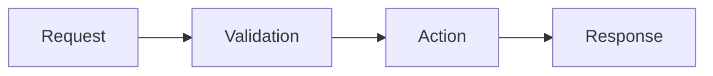

## Changes
<!-- Max 3 short bullets: what users can now do or what was fixed. -->
-

## Example
<!-- Before → After, sample API request/response, or screenshot. -->

## Diagram (optional)
<!-- Remove this section if unnecessary; otherwise replace the example below. -->

## Verified
<!-- Checks actually run and their results. -->
-

## Review notes
<!-- Risks, limitations, or decisions needing attention. “None” is fine. -->

<!-- Link a related issue if applicable; otherwise remove this line. -->
Closes #
