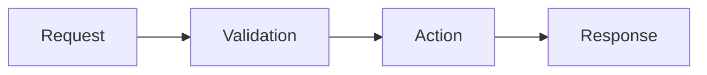

## Changes

<!-- Max 3 short bullets: what users can now do or what was fixed. -->

-

## Example

<!-- Before → After, sample API request/response, or screenshot. -->

## Diagram (optional)

<!--
Remove this section if unnecessary; otherwise replace one example below and delete the other.
Prefer an SVG diagram: upload the .svg into this description, or commit it under
docs/images/ and link it by commit SHA (relative paths do not resolve in PR
descriptions). Keep it legible on light and dark backgrounds.
Use Mermaid only when an SVG is impractical.
-->

## Verified

<!-- Checks actually run and their results. -->

-

## Review notes

<!-- Risks, limitations, or decisions needing attention. “None” is fine. -->

<!-- Link a related issue if applicable; otherwise remove this line. -->

Closes #
