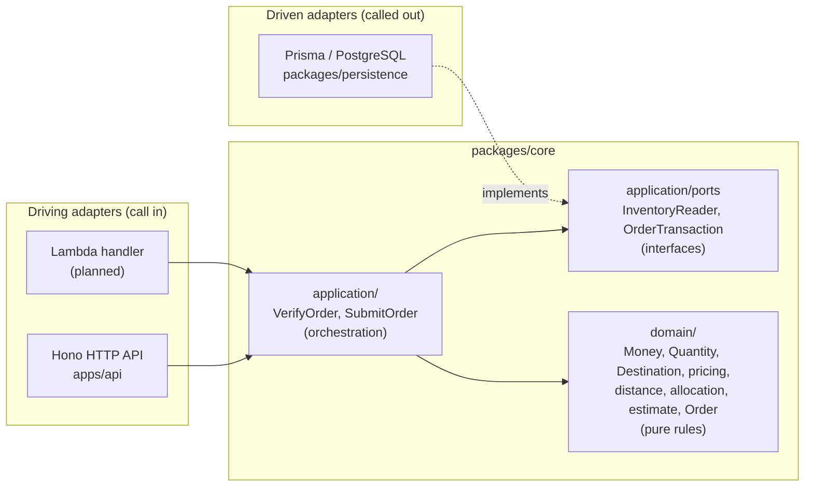
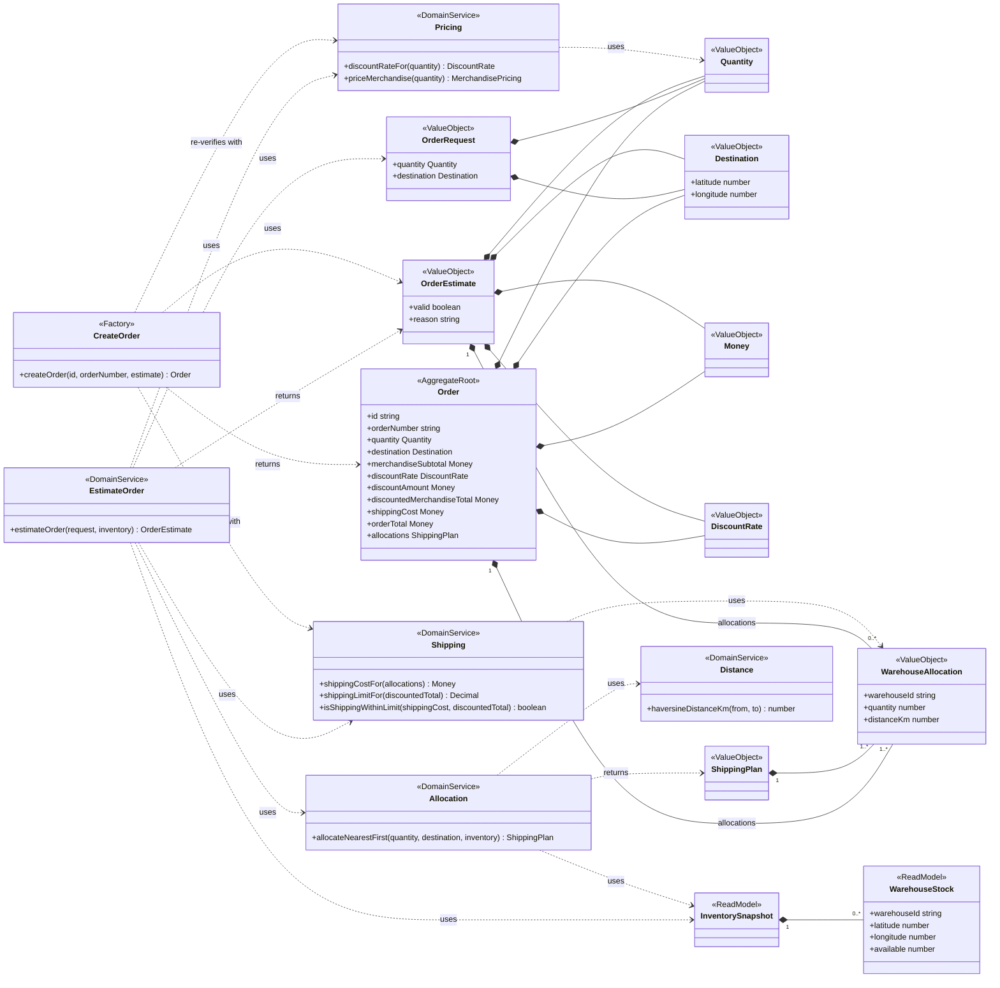

# Architecture

SCOS uses hexagonal architecture (ports and adapters, Alistair Cockburn) for
the structure, and domain-driven design (DDD) for the model inside it. The
business rules sit in the middle. Everything technical, such as HTTP, the
database and Lambda, is a replaceable attachment on the outside. The hexagon
shape has no meaning of its own; it is drawn with many sides because an
application can have many plugs.



## Layers

1. **Domain** (`packages/core/src/domain`) holds the business rules: volume
   discounts, the 15% shipping limit, nearest-warehouse allocation, exact money,
   and the Order aggregate. It consists of pure functions and value objects,
   with no I/O, no ports, and no knowledge of HTTP or databases.
2. **Application** (`packages/core/src/application`, added with the use cases)
   has one use case per thing a caller can do: verify an order and submit an
   order. A use case coordinates: it loads data, calls the domain, and saves the
   result. It needs outside data but must not know how it is stored, so it
   declares what it needs as ports.
3. **Ports** are interfaces owned by core, for example "give me the inventory
   snapshot" or "within one transaction, check for a duplicate submission, lock
   stock and save the order". Core defines their shape and never implements
   them.
4. **Adapters** are the plugs on the outside.
   - **Driving adapters** call into the application. The Hono API turns an HTTP
     request into a use-case call and maps the typed outcome to a status code
     (200, 201, 400, 409, 422 or 500). A Lambda handler is a second driving
     adapter for the same use cases.
   - **Driven adapters** are called by the application. `packages/persistence`
     implements the ports with Prisma and SQL.

## The dependency rule

Dependencies point inward only:

- Adapters depend on core. Core never imports Hono, Prisma or `pg`.
- Inside core, `application/` depends on `domain/`, never the reverse. The
  `no-restricted-imports` rule in `packages/core/.oxlintrc.json` enforces this.
- Adapters import only the package root (`@scos/core`), not internal files.

The database is reached through dependency inversion. The use case needs
persistence, but instead of importing it, core declares a port and
`packages/persistence` implements it. The composition root in `apps/api` wires
the adapter into the use case at startup.

## Where does code go?

Ask whether the code would still be true if HTTP were replaced by a CLI and
PostgreSQL by a spreadsheet:

| Answer                                                  | Layer                 | Examples                                                                       |
| ------------------------------------------------------- | --------------------- | ------------------------------------------------------------------------------ |
| Yes, and it is a rule                                   | Domain                | discount tiers, allocation, shipping limit, Order invariants                   |
| Yes, but it is a sequence of steps needing outside data | Use case, plus a port | lock stock, then allocate, then save; replay an earlier submission             |
| No, it is about a specific technology                   | Adapter               | SQL and row locking, HTTP status codes, Zod request schemas for HTTP, env vars |

For example, warehouse allocation is domain code, not a use case. It applies
business rules (nearest first, stable ID ties, never above stock, no partial
fulfillment) to an in-memory snapshot, has no side effects, and must behave
identically for verification and submission. The use cases decide when to
allocate and with which data; the domain decides how.

## What this buys us

- **Testing:** domain tests are plain unit tests without mocks or a database.
  Use cases can be tested with in-memory fake ports. Only adapters need a real
  PostgreSQL, which the integration tests provide.
- **Swapping technology:** running on Lambda instead of a local server means
  adding a driving adapter, not rewriting logic. Changing the database means
  rewriting one adapter.
- **Clear ownership:** rules in [design decisions](design-decisions.md) such as
  "Prisma types stay outside the domain" and "persist application outcomes, not
  HTTP statuses" are this architecture written down.

## Hexagonal architecture and DDD

The two are separate ideas that fit together. Hexagonal architecture decides
where the boundaries go. DDD decides how to model what is inside: value objects
(`Money`, `Quantity`, `Destination`), aggregates (`Order`) and domain services
(pricing, allocation). The project uses one bounded context, Ordering; its
vocabulary is in [CONTEXT.md](../CONTEXT.md).

## Domain model

The domain layer (`packages/core/src/domain`) models the Ordering context with
one aggregate, a set of value objects and a few stateless domain services.
Solid diamonds are composition (the owner holds the value); dashed arrows are
"uses" or "returns" dependencies of a function.



- **Aggregate root: `Order`.** An accepted order with its identity (`id`,
  `orderNumber`), amounts and allocations. The only way to build one is the
  `createOrder` factory, which accepts only a valid `OrderEstimate` and
  re-verifies every invariant (quantity range, allocations summing to the
  quantity, subtotal, discount tier and amount, shipping cost and the 15% limit,
  order total) before returning a frozen value; a violation throws
  `DomainError`.
- **Value objects** have no identity and are immutable: `Quantity` and
  `Destination` (branded, produced by the Zod input schemas), `Money`,
  `DiscountRate`, `WarehouseAllocation`, `ShippingPlan` (a non-empty list of
  allocations), `OrderRequest` and `OrderEstimate`. An estimate carries the
  request's quantity and destination, the priced amounts, and either a
  `ShippingPlan` or a rejection `reason`.
- **Domain services** are stateless functions: pricing (discount tiers,
  merchandise totals), shipping (combined cost rounded once, exact 15% limit),
  allocation (nearest-first; it returns no plan when stock is insufficient) and
  distance (Haversine). `estimateOrder` composes them into an estimate.

What is deliberately absent:

- **No `Warehouse` entity.** Core never owns or changes warehouses; it only reads
  an `InventorySnapshot` (a list of `WarehouseStock` rows) that a use case loads
  through a port and passes in. Reserving stock is the persistence adapter's job.
- **Estimates have no identity and no repository.** They are recomputed on
  demand and never stored; only an accepted `Order` is persisted.
- **No domain events yet.** Nothing inside the context reacts to an order being
  accepted, so there is nothing to publish.
- **One bounded context, Ordering.** Its terms (Order Request, Order Estimate,
  Warehouse Allocation, Shipping Plan and so on) are defined in
  [CONTEXT.md](../CONTEXT.md).

### Folder layout by concept

```text
packages/core/src/domain/
  shared/    decimal, money, errors, product constants, quantity, destination
  pricing/   discount tiers and merchandise pricing
  shipping/  distance, nearest-first allocation, shipping cost and limit
  ordering/  order request schema, estimateOrder, the Order aggregate
```

Dependencies point one way: `shared` <- `pricing`, `shipping` <- `ordering`.
`shared` imports no other domain folder, `pricing` and `shipping` do not import
each other or `ordering`, and `ordering` may import all of them. No domain file
imports `application/`. `packages/core/.oxlintrc.json` enforces these rules with
`no-restricted-imports`.

The folders follow domain concepts rather than DDD building-block types
(`entities/`, `value-objects/`, `services/`). Code that changes together stays
together: a new discount tier touches only `pricing/`, and a new shipping rate
only `shipping/`. The folder names also match the words in CONTEXT.md, so a
reader can go from a business term straight to its code.
