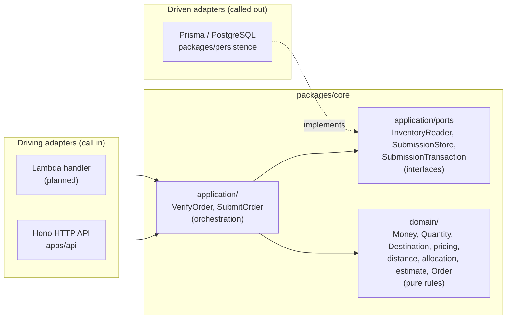
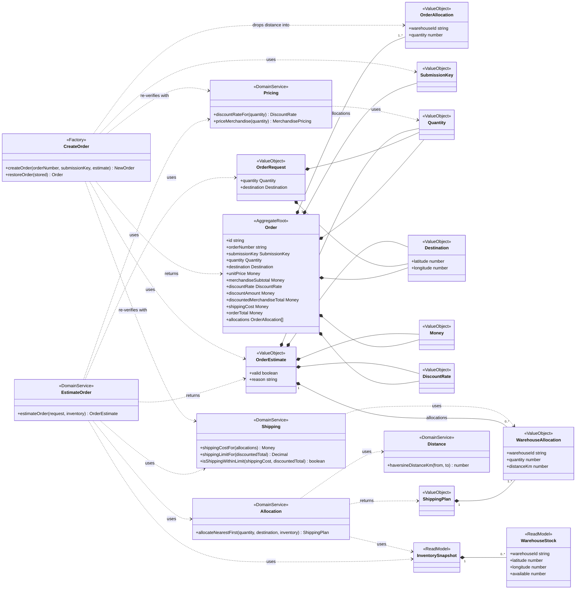

# Architecture

SCOS uses hexagonal architecture (ports and adapters, Alistair Cockburn) for
the structure, and domain-driven design (DDD) for the model inside it. The
business rules sit in the middle. Everything technical, such as HTTP, the
database and Lambda, is a replaceable attachment on the outside. The hexagon
shape has no meaning of its own; it is drawn with many sides because an
application can have many plugs.



## Layers

1. **Domain** (`packages/core/src/domain`) holds the business rules: volume
   discounts, the 15% shipping limit, nearest-warehouse allocation, exact money,
   and the Order aggregate. It consists of pure functions and value objects,
   with no I/O, no ports, and no knowledge of HTTP or databases.
2. **Application** (`packages/core/src/application`) has one use case per thing
   a caller can do: verify an order (`createVerifyOrder`) and submit an order
   (`createSubmitOrder`). A use case coordinates: it loads
   data, calls the domain, and saves the result. It needs outside data but must
   not know how it is stored, so it declares what it needs as ports. See
   [Application layer](#application-layer).
3. **Ports** are interfaces owned by core, for example "give me the inventory
   snapshot" or "within one transaction, lock stock, find the Order already
   stored for this submission key, or save the new order". Core defines their shape and never implements
   them.
4. **Adapters** are the plugs on the outside.
   - **Driving adapters** call into the application. The Hono API validates
     the HTTP request with Zod, turns it into a use-case call and maps the typed
     outcome to a status code (200, 201, 400, 409, 422, 500 or 503; 404 for
     unknown routes). The order endpoints are `POST /api/v1/orders/verify` and
     `POST /api/v1/orders` (the `API_PREFIX` constant); `GET /health` stays at
     the root. See [apps/api/README.md](../apps/api/README.md) for the
     contract. Each endpoint is its own Hono app with its own composition
     (`createHealthApp`, `createVerifyOrderApp`, `createSubmitOrderApp`), which
     builds only the adapters that endpoint needs, so each can be deployed as a
     separate Lambda function. Each lives in its own folder,
     `apps/api/src/endpoints/{health,verify-order,submit-order}/`, with its
     contract, app, composition, configuration and tests; shared HTTP pieces
     (error envelope, JSON handling, shared schemas) are in `src/http/`, which
     never imports an endpoint, and endpoints never import each other.
     `createApp` (`src/app.ts`) mounts all three for the local server and the
     API documentation. Lambda handlers (#14) are a second driving adapter
     over the same per-endpoint apps.
   - **Lambda connections (#14):** each Lambda execution environment has its
     own in-process pg pool and serves one request at a time. Nothing sets the
     pool size yet (pg defaults to 10); the recommendation is for #14 to apply
     and verify `max: 1` per environment. RDS Proxy, the chosen connection
     approach, pools connections across all per-endpoint functions and bounds
     those reaching PostgreSQL. #14 must check whether the transaction's
     `set_config(..., true)` calls pin the client connection, and whether
     pg/Prisma prepared statements do; verify IAM or Secrets Manager
     authentication; and compare proxy timeouts with the 5 s connect timeout.
   - **Driven adapters** are called by the application. `packages/persistence`
     implements the ports with Prisma and SQL.

## The dependency rule

Dependencies point inward only:

- Adapters depend on core. Core never imports Hono, Prisma, `pg` or
  `@scos/persistence`.
- Inside core, `application/` depends on `domain/`, never the reverse.
- The `no-restricted-imports` rule in `packages/core/.oxlintrc.json` enforces
  both for every file under `packages/core/src`.
- Adapters import only the package root (`@scos/core`), not internal files.

The database is reached through dependency inversion. The use case needs
persistence, but instead of importing it, core declares a port and
`packages/persistence` implements it. The composition roots in `apps/api`
(`src/endpoints/<name>/composition.ts` per endpoint, and `src/composition.ts`
for the combined app) wire the adapter into the use case at startup, after the
runtime entrypoint (`src/server.ts` locally) has validated the environment.

## Where does code go?

Ask whether the code would still be true if HTTP were replaced by a CLI and
PostgreSQL by a spreadsheet:

| Answer                                                  | Layer                 | Examples                                                                       |
| ------------------------------------------------------- | --------------------- | ------------------------------------------------------------------------------ |
| Yes, and it is a rule                                   | Domain                | discount tiers, allocation, shipping limit, Order invariants                   |
| Yes, but it is a sequence of steps needing outside data | Use case, plus a port | lock stock, then allocate, then save; return the Order that has the same key   |
| No, it is about a specific technology                   | Adapter               | SQL and row locking, HTTP status codes, Zod request schemas for HTTP, env vars |

For example, warehouse allocation is domain code, not a use case. It applies
business rules (nearest first, stable ID ties, never above stock, no partial
fulfillment) to an in-memory snapshot, has no side effects, and must behave
identically for verification and submission. The use cases decide when to
allocate and with which data; the domain decides how.

## What this buys us

- **Testing:** domain tests are plain unit tests without mocks or a database.
  Use cases can be tested with in-memory fake ports. Only adapters need a real
  PostgreSQL, which the integration tests provide.
- **Swapping technology:** running on Lambda instead of a local server means
  adding a driving adapter, not rewriting logic. Changing the database means
  rewriting one adapter.
- **Clear ownership:** rules in [design decisions](design-decisions.md) such as
  "Prisma types stay outside the domain" and "persist accepted Orders as
  snapshots, not HTTP status codes" are this architecture written down. Only
  accepted Orders are stored ([ADR 0004](adr/0004-deduplicate-accepted-orders.md)):
  a repeated submission is matched by the Order's submission key, rejections
  are not stored, and HTTP statuses are never persisted.

## Application layer

```text
packages/core/src/application/
  verify-order.ts            createVerifyOrder: the VerifyOrder use case
  submit-order.ts            createSubmitOrder: the SubmitOrder use case
  ports/inventory-reader.ts  InventoryReader: driven port for reading stock
  ports/submission-store.ts  SubmissionStore: driven port for one submission transaction
```

**VerifyOrder** answers "what would this Order Request cost right now, and
could it be accepted?". `createVerifyOrder({ inventoryReader })` returns a
function `(request: OrderRequest) => Promise<OrderEstimate>` that:

1. reads one inventory snapshot through the `InventoryReader` port, exactly once
   per call and with nothing cached between calls;
2. passes it to the domain's `estimateOrder`, the same calculation submission
   will use, and returns that Order Estimate unchanged.

The result is a typed outcome, not an HTTP response: a valid estimate, or
`valid: false` with reason `SHIPPING_EXCEEDS_LIMIT` (all amounts and Warehouse
Allocations kept) or `INSUFFICIENT_STOCK` (merchandise and discount amounts
kept, no allocations, `null` shipping cost and order total). Business rejections
are returned; only port failures and `DomainError` reject the promise. Mapping
to status codes belongs to the HTTP adapter.

The estimate is advisory ([ADR 0001](adr/0001-advisory-verification.md)).
Verification creates no Order, reserves and deducts no stock, and writes
nothing, so it does not promise later acceptance: a repeated verification sees
whatever stock is current, and submission recalculates from the stock it locks.

**`InventoryReader`** is the port: `readInventorySnapshot()` resolves to one
coherent, complete, point-in-time `InventorySnapshot`, read-only and without
locks. `createPrismaInventoryReader` in `packages/persistence` implements it
with a single `SELECT` over `warehouses`. One statement sees one MVCC snapshot,
so the stock values are mutually consistent without a transaction (see
[Read pattern for verification](database-schema.md#read-pattern-for-verification-9)).
The composition root wires the two together:

```ts
const verifyOrder = createVerifyOrder({
  inventoryReader: createPrismaInventoryReader(prisma),
});
```

**SubmitOrder** uses its own port, `SubmissionStore`, not `InventoryReader`.
Within one transaction it locks every warehouse row, finds any Order already
stored under the submission key, and saves a new Order while deducting stock
(ADR 0004). It recalculates with the same `estimateOrder`, so a verified
estimate can cost more or be rejected at submission.

## Hexagonal architecture and DDD

The two are separate ideas that fit together. Hexagonal architecture decides
where the boundaries go. DDD decides how to model what is inside: value objects
(`Money`, `Quantity`, `Destination`), aggregates (`Order`) and domain services
(pricing, allocation). The project uses one bounded context, Ordering; its
vocabulary is in [CONTEXT.md](../CONTEXT.md).

## Domain model

The domain layer (`packages/core/src/domain`) models the Ordering context with
one aggregate, a set of value objects and a few stateless domain services.
Solid diamonds are composition (the owner holds the value); dashed arrows are
"uses" or "returns" dependencies of a function.



- **Aggregate root: `Order`.** An accepted order with its identity (`id`,
  `orderNumber`), the client's `submissionKey`, amounts and allocations. A new
  Order is built only by the `createOrder` factory, which accepts only a valid
  `OrderEstimate` and re-verifies every invariant (quantity range, allocations
  summing to the quantity, subtotal, discount tier and amount, shipping cost and
  the 15% limit, order total) before returning a frozen `NewOrder`; a violation
  throws `DomainError`. The database assigns the `id` on insert. A stored Order
  is rebuilt with `restoreOrder`, which checks structure and derived totals but
  not current commercial rules, because accepted amounts are historical facts.
  An Order's allocations (`OrderAllocation`) keep only the warehouse and
  quantity, the facts that are stored, so a rebuilt Order equals the one
  returned at acceptance. The order number is `SO-` plus 12 random Crockford
  base32 characters (see [database schema](database-schema.md#identifiers-and-keys)).
- **Value objects** have no identity and are immutable: `Quantity`,
  `Destination` and `SubmissionKey` (branded, produced by the Zod input
  schemas), `Money`,
  `DiscountRate`, `WarehouseAllocation`, `ShippingPlan` (a non-empty list of
  allocations), `OrderRequest` and `OrderEstimate`. An estimate carries the
  request's quantity and destination, the priced amounts, and either a
  `ShippingPlan` or a rejection `reason`. `SubmissionKey` is the client's retry
  key, stored verbatim as the accepted Order's unique `submission_key`; it is
  not part of what is ordered, so it is not in `OrderRequest`.
- **Domain services** are stateless functions: pricing (discount tiers,
  merchandise totals), shipping (combined cost rounded once, exact 15% limit),
  allocation (nearest-first; it returns no plan when stock is insufficient) and
  distance (Haversine). `estimateOrder` composes them into an estimate.

What is deliberately absent:

- **No `Warehouse` entity.** Core never owns or changes warehouses; it only reads
  an `InventorySnapshot` (a list of `WarehouseStock` rows) that a use case loads
  through a port and passes in. Reserving stock is the persistence adapter's job.
- **Estimates have no identity and no repository.** They are recomputed on
  demand and never stored; only an accepted `Order` is persisted.
- **No domain events yet.** Nothing inside the context reacts to an order being
  accepted, so there is nothing to publish.
- **One bounded context, Ordering.** Its terms (Order Request, Order Estimate,
  Warehouse Allocation, Shipping Plan and so on) are defined in
  [CONTEXT.md](../CONTEXT.md).

### Folder layout by concept

```text
packages/core/src/domain/
  shared/    decimal, money, errors, product constants, quantity, destination
  pricing/   discount tiers and merchandise pricing
  shipping/  distance, nearest-first allocation, shipping cost and limit
  ordering/  order request schema, estimateOrder, the Order aggregate
```

Dependencies point one way: `shared` <- `pricing`, `shipping` <- `ordering`.
`shared` imports no other domain folder, `pricing` and `shipping` do not import
each other or `ordering`, and `ordering` may import all of them. No domain file
imports `application/`. `packages/core/.oxlintrc.json` enforces these rules with
`no-restricted-imports`, alongside the ban on adapter technology imports.

The folders follow domain concepts rather than DDD building-block types
(`entities/`, `value-objects/`, `services/`). Code that changes together stays
together: a new discount tier touches only `pricing/`, and a new shipping rate
only `shipping/`. The folder names also match the words in CONTEXT.md, so a
reader can go from a business term straight to its code.
