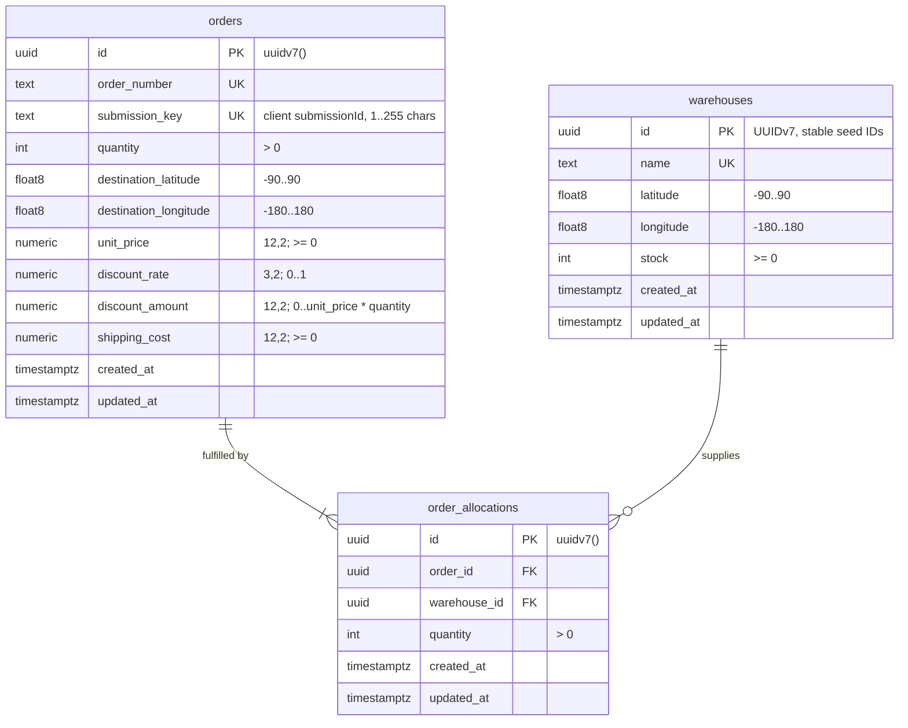

# Database schema

The Ordering persistence schema lives in `packages/persistence`:

- `prisma/schema.prisma`: singular Prisma models mapped to plural snake_case tables, with camelCase fields mapped to snake_case columns (see [Identifiers and keys](#identifiers-and-keys))
- `prisma/migrations/`: versioned SQL migrations, the source of truth for the database
- `src/seed.ts`: the six PRD warehouses and the non-destructive seed
- `src/records.ts`: typed mappings from Prisma rows to plain persistence records

Migrations are applied with `prisma migrate deploy`. The initial migration's table, index, and foreign-key DDL follows Prisma's generated output and was inspected; CHECK constraints and the timestamp defaults and triggers are hand-written SQL because Prisma cannot express them.

Only accepted Orders are stored. A business rejection is returned to the caller and never persisted, so the schema has no submission, rejection, or outcome tables.

## Entity relationships

`order_allocations` has a unique `(order_id, warehouse_id)` pair: one allocation per warehouse per Order.

`orders` has no subtotal or total columns: the merchandise subtotal, discounted merchandise total, and order total are derived on read (see [Normalization](#normalization-3nf)).

## Tables

| Table               | Purpose                                                                                |
| ------------------- | -------------------------------------------------------------------------------------- |
| `warehouses`        | Warehouse location and current Warehouse Inventory (`stock`)                           |
| `orders`            | Accepted Order: duplicate-request key, Order Request, and the commercial facts applied |
| `order_allocations` | Warehouse Allocations of an accepted Order                                             |

## Decisions

### Normalization (3NF)

- Each fact is stored once and depends only on its table's key. Warehouses, Orders, and allocations are separate entities; relationships use foreign keys.
- The Order Request (quantity and destination) lives on the accepted Order, together with the client's `submission_key`. Every column of `orders` depends on the Order itself. Rejected requests are not stored at all: a request whose key has no accepted Order is evaluated fresh, so there is no separate attempt entity to normalize into.
- `orders` stores only independent commercial facts: `unit_price`, `discount_rate`, `discount_amount`, and `shipping_cost`, next to the request's `quantity`. No column is computable from the others, so no non-key column depends on another non-key column.
- All four are stored because they are historical facts about the accepted Order, as required by the design decisions: the price, discount, and shipping that were applied are preserved rather than recalculated from current commercial rules. `discount_rate` and `discount_amount` are both kept because the amount is not a function of the rate in the schema: rounding the discount to cents is a domain rule, so the rate records which tier applied and the amount records what was actually deducted.
- The merchandise subtotal (`unit_price * quantity`), the discounted merchandise total (subtotal minus `discount_amount`), and the order total (discounted total plus `shipping_cost`) are not stored. `toOrderRecord` in `src/records.ts` derives them on read with exact decimal arithmetic (Prisma `Decimal`, never a JavaScript number). The inputs are exact `NUMERIC(12,2)` values and the operations are a multiplication by an integer, a subtraction, and an addition, so the amounts returned always equal what was charged; there is no stored copy that could disagree.
- CHECKs keep every derived amount valid and storable as `NUMERIC(12,2)`, so a row whose totals could not be returned cannot be stored:
  - `orders_discount_amount_check`: `discount_amount >= 0 AND discount_amount <= unit_price * quantity`. The discount cannot exceed the subtotal, so the discounted total and the order total are never negative.
  - `orders_merchandise_subtotal_range_check`: `unit_price * quantity <= 9999999999.99`. The discounted total is bounded by the subtotal, so it needs no check of its own.
  - `orders_order_total_range_check`: `unit_price * quantity - discount_amount + shipping_cost <= 9999999999.99`.
- The CHECK expressions multiply `NUMERIC(12,2)` by an `integer` in unbounded `NUMERIC`, so they are exact at every quantity and cannot overflow: an out-of-range derived amount fails as a CHECK violation (`23514`). The mapping applies the same range on read and refuses an amount beyond `NUMERIC(12,2)` instead of returning a rounded one.
- PostgreSQL evaluates a table's CHECKs in constraint-name order, so `orders_discount_amount_check` runs before `orders_quantity_check` and `orders_unit_price_check`. A negative unit price, or a negative quantity at a positive price, makes the subtotal negative and is reported by the discount CHECK. If both are negative, the subtotal is positive and `orders_quantity_check` reports the row. `orders_unit_price_check` remains as an explicit statement of the column rule.

### Identifiers and keys

- Generated entity IDs are PostgreSQL `uuid` values with a `uuidv7()` default (PostgreSQL 18 built-in). Referencing foreign keys use `uuid`. Prisma declares them as `@default(dbgenerated("uuidv7()")) @db.Uuid`, so PostgreSQL generates them.
- Seeded warehouse IDs are fixed UUIDv7 values (`01996000-0000-7000-8000-00000000000N`), ordered in PRD list order. They never change, so row-lock order and equal-distance tie-breaking stay stable. UUIDv7 ordering is not a commit-order guarantee; queries use explicit `ORDER BY`.
- `orders.submission_key` stores the client's `submissionId` as a unique duplicate-request key: one accepted Order per key. The schema requires it to be non-blank (`btrim(submission_key) <> ''`, matching `order_number` and warehouse `name`) and at most 255 characters (`char_length(submission_key) <= 255`). PostgreSQL's single-argument `btrim` removes spaces only, so a key made only of tabs or newlines passes this check; #11 validates the key format at the API boundary. Any stricter format belongs to the API contract, which must stay within this limit.
- `orders.order_number` is unique and non-empty; its format is decided when submission is implemented.
- Naming convention:
  - SQL tables are plural snake_case (`warehouses`, `orders`); join and child tables are plural too (`order_allocations`). The plural `orders` also avoids the reserved keyword `order`, so raw SQL, including the planned row-locking queries, needs no quoting.
  - Columns are singular snake_case (`warehouse_id`, `submission_key`).
  - Constraint, index, and trigger names derive from the table name, matching Prisma's defaults so the schema reports no drift: `<table>_pkey`, `<table>_<columns>_key` (unique), `<table>_<columns>_idx`, `<table>_<column>_fkey`, `<table>_<column>_check` (or a descriptive `<table>_<rule>_check`, such as `orders_order_total_range_check`), and `update_<table>_updated_at`.
  - Prisma models are singular PascalCase (`Warehouse`, `Order`, `OrderAllocation`) mapped to their tables with `@@map`; fields are camelCase mapped to columns with `@map`.

### Categorical values

- No categorical value is persisted: the only stored outcome is an accepted Order, and rejections are returned rather than stored. The schema therefore has no lookup tables.
- There are no PostgreSQL native enums and no Prisma `enum` declarations, and an integration test asserts that none exist. A future categorical column uses a text-primary-key lookup table (`value`, optional `description`, timestamps) with a foreign key and values inserted by migrations, not a native enum.

### Money and coordinates

- Monetary amounts are `NUMERIC(12,2)`; the discount rate is `NUMERIC(3,2)` constrained to 0 through 1, enough for every PRD tier (0.00, 0.05, 0.10, 0.15, 0.20). PostgreSQL rounds a rate with more than two decimal places to the column scale instead of rejecting it, so a finer tier (such as 12.5%) needs a migration widening the scale first. Stored amounts are nonnegative. A stored value outside `NUMERIC(12,2)`, such as `10000000000.00`, fails with a numeric overflow (`22003`) rather than being stored; a derived amount outside that range fails the range CHECKs above.
- Mappings convert Prisma `Decimal` values to fixed two-decimal strings (`"150.00"`) using the decimal value itself, never a JavaScript number. They refuse non-finite values, values with more decimal places than the column scale, and amounts beyond `NUMERIC(12,2)` instead of rounding. Write amounts to Prisma as decimal strings.
- Coordinates are `double precision`, which matches JavaScript number fidelity without decimal rounding. CHECKs bound warehouse and destination latitude to -90 through 90 and longitude to -180 through 180 (inclusive); `NaN` and infinities fail these checks.

### Outcomes and retention

- The schema stores application outcomes and the facts of each accepted Order, never HTTP status codes or response envelopes. The HTTP adapter maps outcomes to responses.
- Only accepted Orders are stored, and they are kept indefinitely. Cleanup is future work. A business rejection (insufficient stock or excessive shipping) is computed, returned, and forgotten, so there is no rejection history and a rejected request consumes no `submission_key`.
- Every foreign key uses `ON DELETE RESTRICT ON UPDATE RESTRICT`. Deleting or re-keying a warehouse or Order that an allocation still references fails; nothing cascades.
- The schema does not enforce that an Order's allocations sum to its quantity, or that allocations never exceed warehouse stock. These cross-row invariants belong to the SubmitOrder transaction.

### Write pattern for submission (#10)

Within one transaction, SubmitOrder locks the warehouse rows in ascending `id` order, recomputes the outcome from the locked stock, and, on acceptance, inserts the Order and its allocations and decrements stock before committing. A rejection is returned to the caller; nothing is written.

The `submission_key` is the duplicate-request guard. After the warehouse rows are locked, SubmitOrder looks up the Order for that key: if one exists with the same quantity and destination, it is returned as-is and stock is untouched; if the stored request differs, the attempt is a conflict. Otherwise the transaction proceeds, with `orders_submission_key_key` as the backstop against a concurrent attempt (unique violation `23505`). Because rejections are not stored, a rejected request leaves its key unused and a retry is evaluated fresh.

Issue #10's tests must cover allocations summing to the requested quantity and stock never going negative, which the schema does not enforce.

### Timestamps

All three application tables follow [ADR 0003](adr/0003-database-managed-timestamps.md):

- `created_at` and `updated_at` are `timestamptz NOT NULL DEFAULT NOW()`.
- The migration installs `public.update_timestamp()` with `CREATE OR REPLACE`, and each table has a `BEFORE UPDATE ... FOR EACH ROW` trigger named `update_<table>_updated_at` (`update_warehouses_updated_at`, `update_orders_updated_at`, `update_order_allocations_updated_at`), recreated after `DROP TRIGGER IF EXISTS`.
- The Prisma schema declares both columns as `@default(dbgenerated())`. With `@default(now())`, Prisma sends its own clock value on insert instead of letting PostgreSQL apply the transaction time. `@default(dbgenerated("now()"))` would be reported as drift against the migrated `now()` default. `@default(dbgenerated())` makes Prisma omit both columns, and the migration supplies the default. There is no `@updatedAt`.

## Prisma client and connection pooling

- The Prisma 7 client is generated into `packages/persistence/src/generated/prisma`. It is gitignored and excluded from lint, formatting, and coverage. The Turbo `generate` task runs `prisma generate` before `build` and `typecheck`, so a clean checkout builds without a committed client or a database connection.
- `build` bundles the package with tsdown (`tsdown.config.ts`) into `dist/`: `index.js` and `database.js` with bundled `.d.ts` declarations for the package exports, plus `bin/seed.js` and `bin/confirm-reset.js` for `db:seed` and `db:reset`. The generated client is bundled; `@prisma/client` stays external and loads Prisma's query compiler (WASM) at run time.
- `createPrismaClient(pool)` builds the client with `new PrismaPg(pool)` over the pool returned by `createDatabasePool`. There is no second pool. The caller owns the pool: call `prisma.$disconnect()`, then `pool.end()`.
- `prisma.config.ts` reads `DATABASE_URL` from the environment. Prisma 7 does not load `.env` files.

## Commands

Run from the repository root with `DATABASE_URL` set to the target database. `./dev.sh` runs `db:seed` automatically for the worktree database.

| Command                                                         | Effect                                                                                         |
| --------------------------------------------------------------- | ---------------------------------------------------------------------------------------------- |
| `corepack pnpm db:migrate`                                      | Apply pending migrations (`prisma migrate deploy`)                                             |
| `corepack pnpm db:seed`                                         | Apply pending migrations, then insert missing seed warehouses. Existing rows are never changed |
| `SCOS_CONFIRM_DATABASE_RESET=<database> corepack pnpm db:reset` | Destructive: drop all data, reapply migrations, then seed                                      |

The seed uses `INSERT ... ON CONFLICT (id) DO NOTHING`. Rerunning it never replenishes consumed stock or overwrites existing warehouses. If a warehouse name exists under a different ID, the seed fails instead of overwriting it.

`db:reset` refuses to run unless `SCOS_CONFIRM_DATABASE_RESET` exactly matches the database name in `DATABASE_URL`. It then runs `prisma migrate reset --force` and the seed. Use it only for disposable development or test databases. A person runs it: Prisma 7 blocks `prisma migrate reset` when it detects an AI coding agent unless the user explicitly consents.

## Verification

`corepack pnpm test:integration` (with `DATABASE_TEST_URL` set) runs `packages/persistence/test/*.integration.test.ts` against real PostgreSQL. Each test file creates a uniquely named database next to `scos_test` on the disposable test server, applies the migrations with `prisma migrate deploy`, and drops the database afterwards. The tests cover clean migration and drift, timestamp columns and triggers on every table, timestamp behavior through Prisma and raw SQL, UUIDv7 defaults, constraints and restricted deletes, the derived-amount range checks, decimal round-trips, derived totals matching PostgreSQL's arithmetic, and seed reruns.
