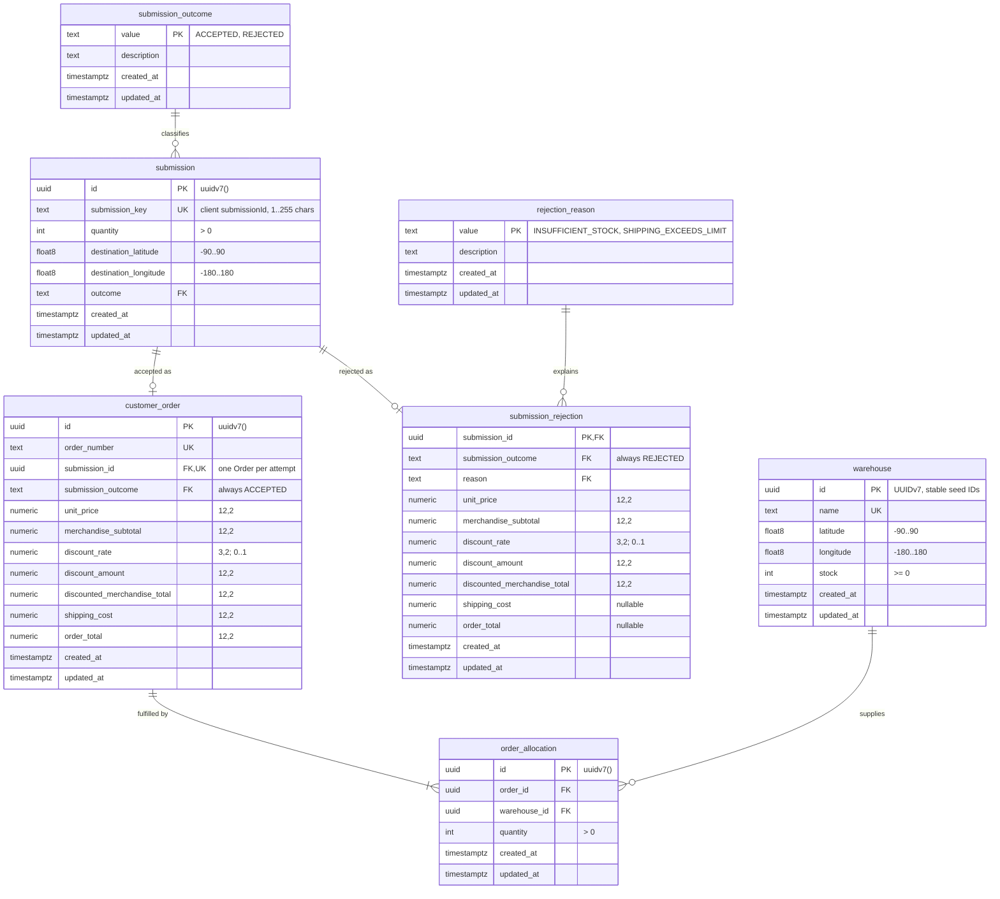

# Database schema

The Ordering persistence schema lives in `packages/persistence`:

- `prisma/schema.prisma`: Prisma models (snake_case tables and columns mapped to camelCase fields)
- `prisma/migrations/`: versioned SQL migrations, the source of truth for the database
- `src/seed.ts`: the six PRD warehouses and the non-destructive seed
- `src/records.ts`: typed mappings from Prisma rows to plain persistence records

Migrations are applied with `prisma migrate deploy`. The initial migration's table, index, and foreign-key DDL was generated by Prisma and inspected; CHECK constraints, timestamp defaults and triggers, and lookup values are hand-written SQL because Prisma cannot express them.

## Entity relationships

`order_allocation` has a unique `(order_id, warehouse_id)` pair: one allocation per warehouse per Order.

## Tables

| Table                  | Purpose                                                                         |
| ---------------------- | ------------------------------------------------------------------------------- |
| `warehouse`            | Warehouse location and current Warehouse Inventory (`stock`)                    |
| `submission`           | One completed submission attempt: retry key, request inputs, and outcome        |
| `customer_order`       | Accepted Order: order number and immutable commercial snapshot                  |
| `order_allocation`     | Warehouse Allocations of an accepted Order                                      |
| `submission_rejection` | Business rejection: reason and the commercial snapshot calculated at submission |
| `submission_outcome`   | Lookup: `ACCEPTED`, `REJECTED`                                                  |
| `rejection_reason`     | Lookup: `INSUFFICIENT_STOCK`, `SHIPPING_EXCEEDS_LIMIT`                          |

## Decisions

### Normalization (3NF)

- Each fact is stored once and depends only on its table's key. Warehouses, submissions, Orders, allocations, and rejections are separate entities; relationships use foreign keys.
- The Order Request (quantity and destination) lives only on `submission`, which is also the idempotency fingerprint for replay and conflict detection. Orders and rejections reach the request through `submission_id` instead of copying it.
- Commercial amounts on `customer_order` and `submission_rejection` are deliberate historical snapshots, as required by the design decisions: accepted prices, discounts, shipping, and totals are preserved rather than recalculated from current commercial rules. `merchandise_subtotal`, `discounted_merchandise_total`, and `order_total` are derivable from other columns in the same row and from the submission quantity. They are stored anyway because they are the exact amounts returned to the customer. Intra-row CHECKs keep them consistent (`discounted = subtotal - discount`, `total = discounted + shipping`). The quantity-dependent relationship (`subtotal = unit_price * quantity`) and the discount rounding rule belong to the domain and are not enforced across tables.
- `unit_price` is also stored on rejections so that each snapshot records the applied price alongside the amounts derived from it.
- `customer_order.submission_outcome` and `submission_rejection.submission_outcome` are constant columns: a CHECK fixes them to `ACCEPTED` and `REJECTED`. Together with the unique `submission (id, outcome)` key, they form composite foreign keys that make it impossible to attach an Order to a rejected attempt or a rejection to an accepted attempt. They do not add independent facts.
- Prisma requires a unique index on every one-to-one foreign key, so `customer_order (submission_id, submission_outcome)` and `submission_rejection (submission_id, submission_outcome)` have unique indexes. They duplicate `customer_order.submission_id`'s unique index and the rejection's primary key, respectively.

### Identifiers and keys

- Generated entity IDs are PostgreSQL `uuid` values with a `uuidv7()` default (PostgreSQL 18 built-in). Referencing foreign keys use `uuid`. Prisma declares them as `@default(dbgenerated("uuidv7()")) @db.Uuid`, so PostgreSQL generates them.
- Seeded warehouse IDs are fixed UUIDv7 values (`01996000-0000-7000-8000-00000000000N`), ordered in PRD list order. They never change, so row-lock order and equal-distance tie-breaking stay stable. UUIDv7 ordering is not a commit-order guarantee; queries use explicit `ORDER BY`.
- `submission.submission_key` stores the client's `submissionId` as a separate unique retry key. The schema requires it to be non-blank (`btrim(submission_key) <> ''`, matching `order_number` and warehouse `name`) and at most 255 characters (`char_length(submission_key) <= 255`). PostgreSQL's single-argument `btrim` removes spaces only, so keys made only of tabs or newlines pass this check; the API contract must reject them. Any stricter format belongs to the API contract, which must stay within this limit.
- `customer_order.order_number` is unique and non-empty; its format is decided when submission is implemented.
- One accepted Order per attempt: `customer_order.submission_id` is unique. One rejection per attempt: `submission_rejection.submission_id` is its primary key.
- The Order table is named `customer_order` because `order` is a reserved SQL keyword and would need quoting in every raw query, including the planned row-locking SQL. The Prisma model is still `Order`.

### Lookup tables

- Categorical values use text-primary-key lookup tables (`value`, optional `description`, timestamps) with foreign keys. There are no PostgreSQL native enums and no Prisma `enum` declarations; Prisma models these columns as `String` fields with relations.
- Lookup values are inserted by migrations, not by the development seed. Adding a value requires a migration. Adding a rejection reason also requires updating `submission_rejection_reason_amounts_check`.
- A CHECK restricts lookup values to uppercase identifiers (`^[A-Z][A-Z0-9_]*$`), which are GraphQL-compatible names.
- `src/records.ts` validates lookup strings into the string-literal unions `'ACCEPTED' | 'REJECTED'` and `'INSUFFICIENT_STOCK' | 'SHIPPING_EXCEEDS_LIMIT'` at the adapter boundary.

### Money and coordinates

- Monetary amounts are `NUMERIC(12,2)`; the discount rate is `NUMERIC(3,2)` constrained to 0 through 1, enough for every PRD tier (0.00, 0.05, 0.10, 0.15, 0.20). PostgreSQL rounds a rate with more than two decimal places to the column scale instead of rejecting it, so a finer tier (such as 12.5%) needs a migration widening the scale first. Amounts are nonnegative. Values outside `NUMERIC(12,2)`, such as `10000000000.00`, fail with a numeric overflow rather than being stored.
- Mappings convert Prisma `Decimal` values to fixed two-decimal strings (`"150.00"`) using the decimal value itself, never a JavaScript number. They refuse non-finite values or values with more decimal places than the column scale instead of rounding. Write amounts to Prisma as decimal strings.
- Coordinates are `double precision`, which matches JavaScript number fidelity without decimal rounding. CHECKs bound latitude to -90 through 90 and longitude to -180 through 180 (inclusive); `NaN` and infinities fail these checks.
- Insufficient-stock rejections have no shipping plan, so `shipping_cost` and `order_total` are `NULL`. Shipping-limit rejections record both. A CHECK enforces this per reason.

### Outcomes and retention

- The schema stores application outcomes and snapshots, never HTTP status codes or response envelopes. The HTTP adapter maps outcomes to responses.
- Accepted and rejected outcomes are kept indefinitely. Cleanup is future work.
- Every historical foreign key uses `ON DELETE RESTRICT ON UPDATE RESTRICT`. Deleting a warehouse, Order, submission, or lookup value that is still referenced fails; nothing cascades. Changing the outcome of a submission that already has an Order or rejection also fails.
- The schema does not enforce that every submission has exactly one Order or rejection, or that allocations sum to the requested quantity. These cross-row invariants belong to the SubmitOrder transaction.

### Write pattern for submission (#10)

`submission.outcome` is `NOT NULL`, and the composite foreign keys pin it: an Order requires an `ACCEPTED` submission and a rejection requires a `REJECTED` one. SubmitOrder therefore cannot insert a placeholder "claim" row before it knows the outcome. Within one transaction, SubmitOrder should:

1. Lock the warehouse rows in ascending `id` order.
2. Read stock and compute the outcome (accepted with allocations, or a business rejection).
3. Insert the submission with `INSERT ... ON CONFLICT (submission_key) DO NOTHING RETURNING id`.
4. If a row is returned, insert the Order and allocations and decrement stock, or insert the rejection, then commit.
5. If no row is returned, or the insert fails with unique violation `23505`, another attempt already committed that key. Roll back without changing stock, then load and replay the stored outcome (or report a conflict if the inputs differ).

The database does not enforce that an `ACCEPTED` submission has an Order or that a `REJECTED` submission has a rejection. Issue #10's tests must cover this invariant, together with allocations summing to the requested quantity.

### Timestamps

All seven application tables follow [ADR 0003](adr/0003-database-managed-timestamps.md):

- `created_at` and `updated_at` are `timestamptz NOT NULL DEFAULT NOW()`.
- The migration installs `public.update_timestamp()` with `CREATE OR REPLACE`, and each table has a `BEFORE UPDATE ... FOR EACH ROW` trigger named `update_<table>_updated_at`, recreated after `DROP TRIGGER IF EXISTS`.
- The Prisma schema declares both columns as `@default(dbgenerated())`. With `@default(now())`, Prisma sends its own clock value on insert instead of letting PostgreSQL apply the transaction time. `@default(dbgenerated("now()"))` would be reported as drift against the migrated `now()` default. `@default(dbgenerated())` makes Prisma omit both columns, and the migration supplies the default. There is no `@updatedAt`.

## Prisma client and connection pooling

- The Prisma 7 client is generated into `packages/persistence/src/generated/prisma`. It is gitignored and excluded from lint, formatting, and coverage. The Turbo `generate` task runs `prisma generate` before `build` and `typecheck`, so a clean checkout builds without a committed client or a database connection.
- `createPrismaClient(pool)` builds the client with `new PrismaPg(pool)` over the pool returned by `createDatabasePool`. There is no second pool. The caller owns the pool: call `prisma.$disconnect()`, then `pool.end()`.
- `prisma.config.ts` reads `DATABASE_URL` from the environment. Prisma 7 does not load `.env` files.

## Commands

Run from the repository root with `DATABASE_URL` set to the target database. `./dev.sh` runs `db:seed` automatically for the worktree database.

| Command                                                         | Effect                                                                                         |
| --------------------------------------------------------------- | ---------------------------------------------------------------------------------------------- |
| `corepack pnpm db:migrate`                                      | Apply pending migrations (`prisma migrate deploy`)                                             |
| `corepack pnpm db:seed`                                         | Apply pending migrations, then insert missing seed warehouses. Existing rows are never changed |
| `SCOS_CONFIRM_DATABASE_RESET=<database> corepack pnpm db:reset` | Destructive: drop all data, reapply migrations, then seed                                      |

The seed uses `INSERT ... ON CONFLICT (id) DO NOTHING`. Rerunning it never replenishes consumed stock or overwrites existing warehouses. If a warehouse name exists under a different ID, the seed fails instead of overwriting it.

`db:reset` refuses to run unless `SCOS_CONFIRM_DATABASE_RESET` exactly matches the database name in `DATABASE_URL`. It then runs `prisma migrate reset --force` and the seed. Use it only for disposable development or test databases. A person runs it: Prisma 7 blocks `prisma migrate reset` when it detects an AI coding agent unless the user explicitly consents.

## Verification

`corepack pnpm test:integration` (with `DATABASE_TEST_URL` set) runs `packages/persistence/test/*.integration.test.ts` against real PostgreSQL. Each test file creates a uniquely named database next to `scos_test` on the disposable test server, applies the migrations with `prisma migrate deploy`, and drops the database afterwards. The tests cover clean migration and drift, timestamp columns and triggers on every table, timestamp behavior through Prisma and raw SQL, UUIDv7 defaults, constraints and restricted deletes, decimal and outcome round-trips, and seed reruns.
