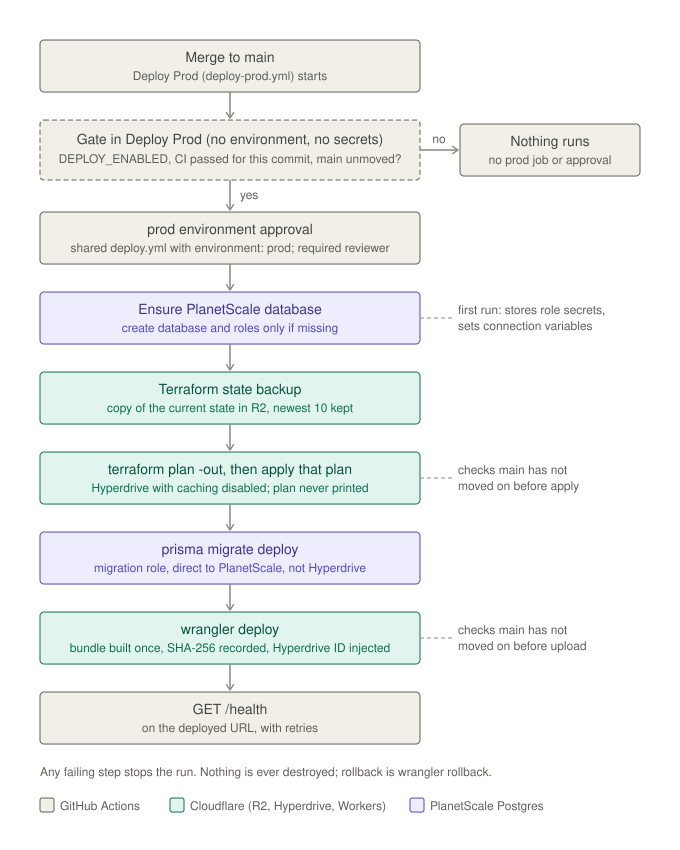

# Deployment pipeline: Terraform, R2 state and the Worker deploy

This is #15's pipeline for the Cloudflare side: Terraform for the Hyperdrive
configuration, its state in R2, and the GitHub Actions workflows that check
pull requests and deploy `main`. The PlanetScale database, its roles and the
seed are in [PlanetScale bootstrap](planetscale-bootstrap.md). The design
inputs are in [Cloudflare deployment design](cloudflare-deployment-design.md)
and [ADR 0005](adr/0005-cloudflare-first-deployment.md).

## Offline preparation and hosted execution

The pipeline is committed, but nothing is provisioned yet:

- `infra-check.yml` runs on pull requests with no secret and no environment.
- `Deploy Prod` (`deploy-prod.yml`) runs on every merge to `main` and deploys
  to `prod`. While the settings are incomplete it fails before creating
  anything: GitHub should reject a missing required repository secret before
  the job starts (unverified until #33; without the R2 keys
  `backend-init.sh` stops anyway), and a missing `prod` setting fails the first step that uses it. As of 2026-09-20 every required
  setting is present, so the next merge deploys and, on the first run,
  creates the database and starts billing. Disable the workflow first if
  that is not wanted yet.

**Hosted execution** depends on the user's account, budget and provisioning
authorization. That covers every step that touches Cloudflare or PlanetScale:
the PlanetScale database and roles (created by the first deploy, which starts
billing), the first Terraform apply, migrations and the Worker deploy. #33
runs and verifies it.

**The deploy creates the database.** By the user's decision
([ADR 0005 amendment](adr/0005-cloudflare-first-deployment.md)), the deploy
job runs the PlanetScale bootstrap first and creates the database and its
roles when they are missing. This relaxes two #15 criteria: the PlanetScale
service token is used by the deploy, not only by the bootstrap workflow, and
a merge to `main` can create the database.

**No human approval, no enable flag, no wait for CI.** By the user's
decisions:

- The `prod` environment has no required reviewers, and the pipeline asks
  for none.
- There is no enable flag. **Merging to `main` with complete settings is the
  provisioning authorization:** every merge deploys to `prod`, and the first
  deploy whose settings are complete creates the PlanetScale database and
  starts billing.
- **The kill switch is disabling the `Deploy Prod` workflow**
  (`gh workflow disable deploy-prod.yml`, or Actions > Deploy Prod > Disable
  workflow). While it is disabled, merges deploy nothing;
  `gh workflow enable deploy-prod.yml` turns deploys back on.
- The deploy does not wait for CI on the merge commit: the pull request's CI
  vouches for the change, and CI and the deploy run in parallel on `main`.
  This relaxes #15's criterion "after main CI succeeds for the same commit".

What still guards `prod`: the gate (the commit is still the head of `main`)
and the main-only checks in the workflows. The `prod` environment has no
deployment-branch rule yet (see the checklist's first step).

**Risk: nothing forces green CI before a merge.** `main`'s branch protection
currently requires no status checks: "require status checks" is on, in strict
mode, but its list of required checks is empty, so it has no effect. It does
not require pull requests either. So a pull request with failing CI can be
merged, and a direct push to `main` deploys without any CI having run. The
fix is to add required status checks (for example "Workspace checks" and
"PostgreSQL integration") and to require pull requests before merging. That
is the user's call; until then, only merge pull requests whose CI passed.

### Operator checklist

In this order. Nothing here is automated.

1. **Restrict `prod` to `main`.** Set the `prod` environment's deployment
   branches to `main` (Settings > Environments > prod > Deployment branches
   and tags > Selected branches), so no other branch's workflow can use its
   secrets. This is a branch policy, not an approver: `prod` has no required
   reviewers, by the user's decision. It is not set as of 2026-09-20.
2. **Check the R2 state bucket** is private (see
   [the bucket](#the-state-bucket-one-time-bootstrap)).
3. **Prepare PlanetScale** (no bootstrap run is needed; the first deploy
   creates the database and roles): set the repository variable
   `PLANETSCALE_ORG`, give the service token its accesses and confirm the
   cluster size SKU
   ([PlanetScale bootstrap](planetscale-bootstrap.md#before-the-first-run)).
4. **Give the `prod` secret `CLOUDFLARE_API_TOKEN` its permissions** (the
   one Cloudflare token; [Credentials](#credentials)) and set the `prod`
   secrets and variables
   in [Credentials](#credentials) and [Configuration](#configuration-contract).
   Set no database credential or connection value: the deploy reads the
   host, username and database name from PlanetScale on every run, and keeps
   the role credentials in the Terraform state
   ([role credentials](#role-credentials-in-the-state)).
5. **Complete the settings only when ready to pay**, or disable the
   `Deploy Prod` workflow until then. Completing them is the provisioning
   authorization; nothing asks again. The next merge to `main` (or a manual
   run of `Deploy Prod` on `main`) deploys without approval, and creates the
   PlanetScale database, starting billing, when it does not exist yet. To
   stop deploys, disable the workflow (`gh workflow disable deploy-prod.yml`).
6. **Seed once:** run `Deploy Prod` manually on `main` with `seed_demo_data`
   checked ([seeding](planetscale-bootstrap.md#seeding-demonstration-data)).

## Resources and owners

| Owner                                                          | Resources                                                                                   |
| -------------------------------------------------------------- | ------------------------------------------------------------------------------------------- |
| `infra/planetscale/` (deploy step; manual workflow for repair) | The PlanetScale database, branch settings, runtime and migration roles                      |
| Terraform, `infra/cloudflare/`                                 | `cloudflare_hyperdrive_config.scos` (named `scos-prod`); DNS only if a custom host is added |
| Wrangler, `apps/api/wrangler.jsonc`                            | The `scos-api` Worker, its versions, vars, secrets and the `HYPERDRIVE` binding             |
| Created once by hand, outside Terraform                        | The R2 state bucket and its key pair                                                        |

## Terraform

`infra/cloudflare/`:

| File                          | Contents                                                                                                                                        |
| ----------------------------- | ----------------------------------------------------------------------------------------------------------------------------------------------- |
| `versions.tf`                 | Terraform `>= 1.11, < 2` (CI pins 1.16.3), `cloudflare/cloudflare` 5.25.0, the `s3` backend                                                     |
| `main.tf`                     | The Hyperdrive configuration                                                                                                                    |
| `credentials.tf`              | The PlanetScale role credentials kept in the state ([below](#role-credentials-in-the-state))                                                    |
| `variables.tf`, `outputs.tf`  | Inputs; the outputs `hyperdrive_id` and `migration_database_url` (both sensitive)                                                               |
| `.terraform.lock.hcl`         | Provider hashes for linux_amd64, linux_arm64, darwin_arm64 and darwin_amd64                                                                     |
| `tests/hyperdrive.tftest.hcl` | `terraform test` with a mocked provider: caching, connection limit, origin, validations, and storing, keeping, rotating and missing credentials |
| `scripts/`                    | Backend init, state backup, main-head check, Worker bundle and deploy configuration                                                             |

The Hyperdrive configuration follows #28:

- **Origin** from non-secret inputs read from PlanetScale on every deploy:
  the branch host, port 5432, scheme `postgres`, the runtime username
  (exactly as PlanetScale reports it) and the PostgreSQL database name (from
  the stored migration URL, usually `postgres`; not the PlanetScale database
  name). The operator variables `PLANETSCALE_HOST`, `HYPERDRIVE_ORIGIN_USER`
  and `HYPERDRIVE_ORIGIN_DATABASE` override them. The password is the runtime
  role's, stored in the state (`credentials.tf`).
- **Caching** `caching = { disabled = true }`, set explicitly.
- **`origin_connection_limit = 5`**, validated to 5-20. Raise it only within
  the [budget rule](cloudflare-deployment-design.md#connection-budget).
- **TLS**: Hyperdrive's default `sslmode=require`. `verify-full` is optional
  hardening and not set.

To change the provider version, edit `versions.tf` and regenerate the lock
file for all four platforms:

```sh
cd infra/cloudflare
terraform providers lock -platform=linux_amd64 -platform=linux_arm64 \
  -platform=darwin_arm64 -platform=darwin_amd64
```

### One Wrangler

The pipeline and its scripts (the dry-run build and the deploy) use the one
Wrangler pinned in the workspace: `apps/api`'s `devDependencies`, run as
`apps/api/node_modules/.bin/wrangler` after `pnpm install --frozen-lockfile`.
Nothing uses `npx` or a global install, so a Wrangler upgrade is one change to
`apps/api/package.json` and the lockfile. The `wrangler ...` commands an
operator runs in this document (rollback, secrets, teardown, R2 checks) mean
the same binary: `pnpm --filter @scos/api exec wrangler ...`.

### Hyperdrive ID injection

The pipeline injects the ID from the Terraform output; nothing is committed.
`apps/api/wrangler.jsonc` keeps its placeholder ID and `localConnectionString`,
so `wrangler dev` and the Workers tests are unchanged.

`scripts/worker-deploy-config.mjs` reads `wrangler.jsonc` and writes a
separate deploy configuration on the runner. It:

- requires exactly one `HYPERDRIVE` binding with the placeholder, and a
  32-hex ID that is not the placeholder;
- sets that ID and drops `localConnectionString`;
- points `main` at the built bundle with `no_bundle`, so Wrangler uploads the
  files as built;
- sets the non-secret `vars` from the environment (allow-list) and the
  placement hint;
- validates the result with the Worker's own `parseWorkerConfig`, including
  `OTEL_EXPORTER_OTLP_HEADERS` from the secret, and fails with
  `NAME: reason` lines and no values.

The generated file is not uploaded and is deleted with the job. A
committed ID would work too (the ID is not a secret), but it would couple the
repository to one account and go stale on a `terraform destroy`.

### Placement hint

The deploy configuration sets `"placement": { "region": "aws:ap-southeast-1" }`,
beside the database in Singapore. A submission makes several round trips to
the database, so running the Worker there shortens each one. It is only in
the generated configuration, so local development never sees it. Set the
`prod` variable `WORKER_PLACEMENT_REGION` to `none` to drop it, or to another
region. Whether the hint needs a paid plan is unverified; if the first deploy
rejects it, set `none`.

## Terraform state

### Backend

State is in the private R2 bucket, split by environment through the key:
`TF_STATE_KEY` is `scos/<env>/terraform.tfstate`. The `s3` backend block
holds the fixed R2 settings: `use_path_style`, `use_lockfile = true`, and the
`skip_credentials_validation`, `skip_region_validation`,
`skip_requesting_account_id`, `skip_metadata_api_check` and
`skip_s3_checksum` flags. `scripts/backend-init.sh` supplies the rest from the
environment's variables (`TF_STATE_BUCKET`, `TF_STATE_ENDPOINT`
`https://<account_id>.r2.cloudflarestorage.com`, `TF_STATE_REGION` `auto`,
`TF_STATE_KEY`, `TF_STATE_WORKSPACE_PREFIX`). Terraform reads the R2 key pair
from `AWS_ACCESS_KEY_ID` and `AWS_SECRET_ACCESS_KEY`, mapped from the
repository secrets `R2_ACCESS_KEY_ID` and `R2_SECRET_ACCESS_KEY` in the deploy
job only. Only the default workspace is used.

To work on the state locally (for example a restore), export the same
variables and the R2 key pair, then:

```sh
infra/cloudflare/scripts/backend-init.sh infra/cloudflare
```

### Locking

Locking relies on the s3 backend's own lock file: `use_lockfile = true`
writes `<key>.tflock` with a conditional put (`If-None-Match`), which R2's S3
API lists as supported, so a second run against the same key fails with
`Error acquiring the state lock` instead of writing concurrently.

- **Shown locally, not on R2.** During development (2026-09-19) a second
  Terraform run against the same key was rejected with
  `StatusCode: 412 ... PreconditionFailed` while the first held the lock,
  against MinIO `RELEASE.2025-09-07T16-13-09Z` with Terraform 1.11.2 and
  1.16.3, and the lock was released afterwards. It was not proven against
  R2: by the user's decision, the issue's "prove on R2" criterion is dropped.
  That locking behaves the same on R2 is a known, accepted risk.
- **The workflows serialize themselves.** The caller's `deploy-prod`
  concurrency group runs one deployment at a time and never cancels a
  running one, so the pipeline never races itself; the lock file guards
  against anything else (an operator's local run, another workflow).
- Every plan and apply waits up to 5 minutes for the lock
  (`-lock-timeout=5m`), then fails. Never pass `-lock=false`.

### Role credentials in the state

By the user's decision, the PlanetScale role credentials are kept in the
Terraform state instead of GitHub environment secrets. The deploy writes no
GitHub secret or variable, and needs no token that could
(`ENVIRONMENT_SECRETS_TOKEN` is gone).

- **How they get there.** A role's password is shown only when the role is
  created or reset. In that run, the bootstrap step exports it, masked, to
  `$GITHUB_ENV`, and the very next step, "Store fresh role credentials in the
  state", writes it to the state with a **targeted** plan and apply of only
  the affected `terraform_data.planetscale_runtime_password` or
  `terraform_data.migration_database_url` (`-target` and `-replace`, a 5-minute
  lock timeout, nothing printed, the saved plan deleted), then clears the
  `$GITHUB_ENV` values. Each resource keeps what it stored
  (`ignore_changes = [input]`), so the full plan later in the run, and every
  later run, needs no credential input. A new value is taken only with
  `-replace`.
- **Why a separate, targeted apply.** The full plan and apply come later,
  after the database settings check and with a `main`-head check right before the
  apply. Anything failing in between (a transient plan error, a second merge
  that makes the head check stop this run, a cancellation or a timeout) would
  otherwise discard the only copy of a credential PlanetScale will not show
  again. The store step runs even when the bootstrap step failed after
  creating one role, and on cancellation (`if: always()` plus a credential to
  store), and it has no head check: storing a credential is always correct,
  whichever commit deploys next. Terraform prints its usual warning about
  `-target`; that is expected here. The state is backed up before it
  ([below](#backups-and-recovery)).
- **Where the fresh values are visible.** Only in the bootstrap step, which
  issues them, and the store step, which clears them. The earlier steps
  (checkout, build, backend init, backup) run before they exist,
  and every later step ("Check the database settings", plan, apply,
  migrations, Worker) runs after they are cleared.
- **Consumers.** Hyperdrive's origin password reads the stored runtime
  password. The migration step reads `terraform output -raw
migration_database_url`, registers the URL, its password part and, when
  different, the decoded password with `::add-mask::`, and passes the URL
  only to `prisma migrate deploy` (and the seed).
- **Nothing to use fails the plan.** If the state holds no credential, the
  full plan fails, before anything is applied, with "No runtime role
  password" or "No migration role URL" (both checked on the Hyperdrive
  resource, so a targeted store of one credential never trips over the
  other).
- **The state backup is the credential backup.** The pre-apply backups
  ([below](#backups-and-recovery)) are the only other copies. There is no
  GitHub copy to fall back on.

**Rotation:** run `Deploy Prod` manually on `main` with `rotate_credentials`
set to `runtime`, `migration` or `both`. The bootstrap step resets the role
(`pscale role reset`), the store step replaces the stored value at once, and
the full apply then updates Hyperdrive's origin password in place. The old
password stops working at the reset, so the Worker fails database calls for
the minute or two until that apply. For the migration role, the URL's
database name comes from the reset output; if PlanetScale does not report
it, from `HYPERDRIVE_ORIGIN_DATABASE`, then the name in the currently stored
URL, then `postgres`. A reset done by hand outside the deploy leaves the state
holding a dead password: rotate through the deploy instead.

**A failed rotation.** If the run fails after the store step, the new
credential is already stored: rerun the deploy (no rotation needed) and
Hyperdrive gets the new password. If it fails between the reset and the
store (the store step itself failing), the role's password in PlanetScale is
one nothing holds, and **restoring a state backup does not help**: every
backup holds the old, already dead password. Rotating that role again is the
only fix.

**A lost or unusable state** (the next plan fails with "No runtime role
password" or "No migration role URL", or Hyperdrive fails to connect).
Recover in this order:

1. Restore the newest state backup
   ([backups and recovery](#backups-and-recovery)) and run `Deploy Prod`
   again. This restores the credentials with it, when the backup holds them
   and no rotation happened since that backup.
2. Otherwise rotate: run `Deploy Prod` with `rotate_credentials: both` (or the
   one role that is missing). Its credential is reset and stored again.
3. If the whole state is gone, Hyperdrive also exists in Cloudflare without
   a state entry. Import it first, then rotate both roles:
   `terraform -chdir=infra/cloudflare import cloudflare_hyperdrive_config.scos '<account_id>/<hyperdrive_id>'`
   (after `backend-init.sh`, with the non-secret `TF_VAR_*` inputs of the
   plan step), or delete the orphaned Hyperdrive configuration in the
   dashboard and let the deploy create a new one.

### The state is a secret

The state holds both PlanetScale role credentials: the runtime role's
password (Hyperdrive's origin password) and the migration role's URL.

- `*.tfstate*`, `*.tfplan` and `.terraform/` are ignored by Git.
- Both outputs, `hyperdrive_id` and `migration_database_url`, are
  `sensitive`; the workflow reads each with `terraform output -raw` and masks
  it.
- **The saved plan never leaves the job.** Plan and apply run in the same job
  on the same runner, so no artifact is needed. The plan file holds both
  credentials in clear text; it is written with `umask 077` and deleted at the
  end of the job, whatever the outcome. The plan is never printed: the log
  and the job summary show only `actions address` lines from
  `terraform show -json`. No plan or state reaches a pull request comment.
- Apply output shows progress lines only. Sensitive values are redacted by
  Terraform; the Hyperdrive ID may appear before it is masked, which is
  acceptable: it is not a credential.

### Backups and recovery

R2 does not implement object versioning (`PutBucketVersioning` is listed as
unsupported in R2's S3 compatibility table, checked 2026-09-19). So the
deploy takes a bounded backup before every plan:
`scripts/state-backup.sh backup <commit>-run<id>` copies the state object,
server-side, to `scos/<env>/state-backups/terraform.tfstate.<UTC time>.<label>`
in the same bucket and keeps the newest 10 (`STATE_BACKUP_KEEP`). The first
apply has no state and skips the backup. R2 tokens are scoped to a bucket, not
a prefix, so the backups are exactly as private as the state.

To restore, with no deploy running:

```sh
# The same TF_STATE_* variables and R2 key pair as backend-init.sh.
infra/cloudflare/scripts/state-backup.sh list
infra/cloudflare/scripts/state-backup.sh restore scos/prod/state-backups/terraform.tfstate.<time>.<label>
infra/cloudflare/scripts/backend-init.sh infra/cloudflare
terraform -chdir=infra/cloudflare plan   # with the TF_VAR_* inputs
```

`restore` refuses while `<key>.tflock` exists. If the backup predates a
change, the plan shows it; apply to bring Cloudflare back in line, or
`terraform import cloudflare_hyperdrive_config.scos '<account_id>/<hyperdrive_id>'`
if the state lost the resource.

### The state bucket (one-time bootstrap)

The bucket and its key pair were created once, by hand, outside Terraform, so
Terraform never manages its own backend. To repeat it:

1. Create the bucket: dashboard R2 > Create bucket, or
   `wrangler r2 bucket create <bucket>` with an account login. Put its name in
   each environment's `TF_STATE_BUCKET`.
2. Keep it private: public access off, no r2.dev URL
   (`wrangler r2 bucket dev-url get <bucket>` reports it disabled), and no
   custom domain (`wrangler r2 bucket domain list <bucket>` is empty).
3. Create an R2 API token (R2 > Manage API tokens) with **Object Read &
   Write** on this bucket only. Store its access key ID and secret as the
   repository secrets `R2_ACCESS_KEY_ID` and `R2_SECRET_ACCESS_KEY`.
4. Set `TF_STATE_ENDPOINT` to `https://<account_id>.r2.cloudflarestorage.com`
   and `TF_STATE_REGION` to `auto` on each environment.

R2 tokens scope to a bucket. If a second stack (for example the deferred AWS
track) needs state, give it its own prefix, and revisit sharing the bucket.

## Credentials

Cloudflare has no GitHub OIDC federation for API tokens (checked
2026-09-19: no documented feature; an open feature request exists). This
pipeline uses **scoped, long-lived tokens**, the downgrade ADR 0005 accepts.
Give each token an expiry and rotate it.

**One Cloudflare token.** By the user's decision, the existing `prod` secret
`CLOUDFLARE_API_TOKEN` serves Terraform, Wrangler and the billing signature.
This replaces #15's two separately scoped tokens (one for Terraform, one for
Wrangler). The trade-off: a leak of this one token exposes Hyperdrive, DNS,
the Worker and the ability to create a Cloudflare-billed database at once.
Its permissions are the union of what the three uses need:

- Account: **Hyperdrive Edit** (Terraform's Hyperdrive configuration);
- Zone: **DNS Edit** on one zone, only if a custom hostname is added;
- Account: **Workers Scripts Edit** (`wrangler deploy`, rollback, delete, and registering the `workers.dev` subdomain once);
- whatever `wrangler hyperdrive planetscale signature` needs, which is
  unverified until the first real run (Hyperdrive Edit is the likely one).

| Credential                                                              | Kind                               | Scope                                                                                                                          | Used by                                                                                                                        |
| ----------------------------------------------------------------------- | ---------------------------------- | ------------------------------------------------------------------------------------------------------------------------------ | ------------------------------------------------------------------------------------------------------------------------------ |
| `R2_ACCESS_KEY_ID`, `R2_SECRET_ACCESS_KEY`                              | Repository secrets                 | R2 Object Read & Write on the state bucket                                                                                     | Inherited by `deploy.yml` from `deploy-prod.yml` only (the bootstrap does not need them)                                       |
| `PLANETSCALE_SERVICE_TOKEN` (+ variable `PLANETSCALE_SERVICE_TOKEN_ID`) | Repository secret                  | Create the database, manage its roles ([accesses](planetscale-bootstrap.md#before-the-first-run))                              | Inherited by `deploy.yml` from `deploy-prod.yml` (bootstrap step); `planetscale-bootstrap.yml`                                 |
| `CLOUDFLARE_API_TOKEN`                                                  | `prod` secret                      | The one Cloudflare token: Hyperdrive Edit, Workers Scripts Edit, DNS Edit if a custom host is added, and the billing signature | `deploy.yml`: bootstrap step (only while the database is missing), Terraform steps, Wrangler step; `planetscale-bootstrap.yml` |
| Runtime role password                                                   | Terraform state                    | Hyperdrive's origin credential ([role credentials](#role-credentials-in-the-state))                                            | Terraform (Hyperdrive origin)                                                                                                  |
| Migration role URL                                                      | Terraform state (sensitive output) | The migration role, direct to the branch host on 5432, `sslmode=require`                                                       | `deploy.yml` migration step (migrations and the optional seed)                                                                 |
| `OTEL_EXPORTER_OTLP_HEADERS` (optional)                                 | `prod` secret                      | Collector credentials, uploaded as a Worker secret                                                                             | `deploy.yml`, Wrangler step                                                                                                    |

- Each stored secret is mapped into the environment of the steps that need it,
  never the whole job. `CLOUDFLARE_API_TOKEN` is mapped into the bootstrap,
  Terraform and Wrangler steps only. The exception is a run that creates or
  resets a role: its fresh credential goes through `$GITHUB_ENV` from the
  bootstrap step to the store step right after it, which clears it; no
  other step sees it. The migration URL read from the state is used only
  inside the migration step.
- `infra-check.yml` references no secret and no environment, and pull
  requests from forks never reach the deploy workflows: `Deploy Prod` runs on
  a **push** to `main` in this repository (or a manual run on `main`), and
  `deploy.yml` only as its callee. The caller uses `secrets: inherit`, so the
  shared workflow sees the repository secrets (the R2 key pair, the
  PlanetScale service token) and, in its `prod`-bound job, the `prod`
  environment's secrets. Only these two deploy workflows reference the R2 key
  pair and the service token. The Worker never sees a PlanetScale credential; it only has the
  Hyperdrive binding.
- The deploy job does not use the Turbo remote cache, so the uploaded bundle
  is always built from source, from the merge commit being deployed. It is
  not CI's artifact: CI builds and tests the same commit separately, in
  parallel.

**One-time order**, with no circular dependency: R2 bucket and key pair (by
hand) → the Cloudflare API token and `prod` variables → the last missing
setting (the first merge after it deploys) → first deploy (the bootstrap step creates the
database and roles; Terraform stores the role credentials and creates
Hyperdrive; migrations run; the Worker deploys) → a manual deploy with
`seed_demo_data`. The manual
`planetscale-bootstrap.yml` can still create the database first, for example
as a dry run, but is not required.

**Rotation.** Role passwords: run `Deploy Prod` manually with
`rotate_credentials` ([role credentials](#role-credentials-in-the-state)).
The runtime password change updates Hyperdrive in place; the Worker keeps the
same Hyperdrive ID. The Cloudflare API token: create the new token
with the same permissions, update `CLOUDFLARE_API_TOKEN`, delete the old
token. One rotation covers Terraform, Wrangler and the billing signature.

## Pipeline

### Pull requests: `infra-check.yml`

| Job                                    | Checks                                                                                                                                                                                                                                                      |
| -------------------------------------- | ----------------------------------------------------------------------------------------------------------------------------------------------------------------------------------------------------------------------------------------------------------- |
| Terraform                              | `terraform fmt -check -recursive infra`; `init -backend=false -lockfile=readonly` and `validate`; `terraform test`; an explicit "Terraform plan skipped: no trusted credentials in PR runs" notice                                                          |
| State backup (local S3)                | The backup/prune/restore script against MinIO in the job                                                                                                                                                                                                    |
| Shell scripts                          | ShellCheck 0.11.0 (pinned image) on every `infra/**/*.sh` and the PlanetScale test stubs; the PlanetScale bootstrap tests                                                                                                                                   |
| Worker bundle and deploy configuration | The deploy's own scripts with a fake Hyperdrive ID: build once, size budget (8 MiB, 3 MiB gzip, as `worker.bundle.test.ts`), checksums, generated config validated by the Worker schema, and a `--no-bundle` dry run whose modules must match the checksums |

Actionlint (`actionlint.yml`) checks the workflows on any change under
`.github/workflows/`.

### Deploy workflows: a shared workflow and one caller per environment

| Workflow                          | Role                                                                                                                                                                                                                                                                                                                                                                             |
| --------------------------------- | -------------------------------------------------------------------------------------------------------------------------------------------------------------------------------------------------------------------------------------------------------------------------------------------------------------------------------------------------------------------------------- |
| `deploy.yml` ("Deploy (shared)")  | Reusable (`on: workflow_call` only). Inputs `environment`, `sha`, `terraform_working_dir` (default `infra/cloudflare`), `rotate_credentials`, `seed_demo_data`; secrets inherited from the caller; it declares the three repository secrets (the R2 key pair, the PlanetScale service token) as `required`. One job, `deploy`, bound to `environment: ${{ inputs.environment }}` |
| `deploy-prod.yml` ("Deploy Prod") | Thin caller for `prod`: triggers, the `deploy-prod` concurrency group, the gate, and one call with `environment: prod`                                                                                                                                                                                                                                                           |

Nothing pauses for an approval: `prod` has no required reviewers. The caller
passes secrets with `secrets: inherit`. The first real run (35459265564)
showed that with named secrets passed, the `prod` environment's own secrets
(such as `CLOUDFLARE_API_TOKEN`) came through empty even though the job binds
`environment: prod`; it failed at a settings check before changing anything.
`inherit` is the documented way to make them visible; the next deploy getting
past its first Cloudflare step is the proof (#33).

The shared workflow declares the three repository secrets it needs (the R2
key pair and the PlanetScale service token) as `required`, so GitHub rejects
the call before any job starts when one is missing. There is no separate
settings-check step any more, by the user's decision. The environment's
secrets and variables (`CLOUDFLARE_API_TOKEN`, `TF_STATE_*`,
`CLOUDFLARE_ACCOUNT_ID`) cannot be declared, because the caller has no
environment, so a missing one fails the first step that uses it, with that
tool's own error. The trade-off:
`deploy.yml` can now read every repository secret, including the Turbo
ones, though it references only the R2 key pair, the PlanetScale token and
the `prod` secrets. The "Shell scripts" job in `infra-check.yml` runs
`infra/cloudflare/scripts/check-deploy-secrets.mjs`, which fails on any secret
read in a `deploy.yml` expression outside that allow-list, or on a read of
the whole secrets context, so a new reference needs a deliberate change
there.



**Primary trigger: a merge to `main`** (`on: push: branches: [main]`).
Secondary: a manual run (`workflow_dispatch`, on `main` only) redeploys
`main`'s head, through the same gate as a push. Its two inputs are the operator
actions, never taken by a push:

- `rotate_credentials` (`none`, `runtime`, `migration`, `both`): reset those
  roles and replace their stored credentials
  ([role credentials](#role-credentials-in-the-state));
- `seed_demo_data`: after the migrations, insert the demo warehouses that are
  missing ([seeding](planetscale-bootstrap.md#seeding-demonstration-data)).

1. **Check main** (the gate, in `deploy-prod.yml`; no environment, no
   secret, `contents: read`). Runs only on `main`. It checks that `main` is
   still at this commit and skips, with a notice, when it has moved on; an
   API error fails it. It does not wait for CI, which runs in parallel.
2. **Deploy** (`deploy.yml`'s `deploy` job, `environment: prod`, starts
   without an approval), checking out exactly the gated commit:
   1. `main` must still be at that commit (checked again, below), and every
      required variable and secret must be set; otherwise nothing runs.
   2. Build the Worker bundle once, in this job, from the merge commit
      (`wrangler deploy --dry-run --outdir`; CI's own build is not reused),
      check the size budget, and record the SHA-256 of `worker.js` and the
      `.wasm` module in the job summary. Every install (pnpm, pscale with a
      pinned checksum, Terraform) runs before any step holds a secret.
   3. **Terraform state:** initialize against R2 and back up the state
      (every run, before anything can write to it), and read the non-secret
      database name from the stored migration URL.
   4. **Ensure the PlanetScale database:** check `main` again, then run
      `infra/planetscale/bootstrap.sh` with creation enabled. It creates the
      database (with the Cloudflare billing signature), the runtime role and
      the migration role only when missing, and resets a role only when
      `rotate_credentials` names it. A new or reset role's credential is
      exported masked to `$GITHUB_ENV`
      ([same-run values](planetscale-bootstrap.md#same-run-values-in-the-deploy)),
      and the next step stores it in the state at once with a targeted apply
      and clears it ([role credentials](#role-credentials-in-the-state)). The
      branch host and runtime username are read from PlanetScale on every
      run; a check then fails the deploy if either is missing.
   5. **Terraform:** `terraform plan -out` (no credential input; it fails if
      the state holds no credential), then `terraform apply` of exactly that
      saved plan (after checking `main` again), then read `hyperdrive_id`.
   6. **Migrations:** `prisma migrate deploy` with the migration URL from
      `terraform output`, masked, after checking it points at the branch host
      on 5432 with `sslmode=require` or stricter: directly to PlanetScale,
      never through Hyperdrive. With `seed_demo_data` (manual runs only), the
      seed follows with the same URL.
   7. **Worker:** generate the deploy configuration (with
      `DEPLOYMENT_ENVIRONMENT` set to the environment name); make sure the
      account has a `workers.dev` subdomain
      (`infra/cloudflare/scripts/ensure-workers-subdomain.sh`: registers
      `WORKERS_DEV_SUBDOMAIN`, default `scos-<repository owner>`, only when
      the account has none, because Wrangler asks for one only
      interactively and fails in CI; first seen in run 35462498113); check
      `main` again, re-verify the checksums, and `wrangler deploy` the built files
      (`no_bundle`), with `OTEL_EXPORTER_OTLP_HEADERS` uploaded as a Worker
      secret (`--secrets-file`, a private file removed at once). The dry run
      of this configuration uploads byte-identical modules (checked in CI).
   8. **Health check:** `GET /health` must return `{"status":"ok"}` within 12
      tries, 10 s apart (60 tries in the run that registers the `workers.dev`
      subdomain, which can take minutes to resolve).
   9. Delete the plan and generated files, always.

Any failing step fails the run, and later steps do not run: a failed
migration never deploys the Worker. Nothing is destroyed automatically, on
merge or on failure.

- **Never an older commit over a newer one.** The gate skips a commit that
  is no longer the head of `main` (for example after waiting in the
  `deploy-prod` group). The deploy job checks again as its first step, before the
  database bootstrap, before `terraform apply` and before `wrangler deploy`,
  because "Re-run failed jobs" reruns only the deploy job with the gate's old
  commit, and a run can wait in the concurrency groups (`deploy-prod`,
  `planetscale-prod`) while `main` moves on. When `main` has moved, the step
  fails with "Stale deploy stopped"; the newer commit's own run deploys it. A
  stop before `terraform apply` changes nothing; a stop before
  `wrangler deploy` can leave Hyperdrive and migrations from the older commit
  in place, which the newer commit's deploy then brings forward.
- **Serialization.** Caller concurrency group `deploy-prod`,
  `cancel-in-progress: false`. A newer push replaces a pending run, which shows as
  cancelled; the newer commit deploys instead. The shared `deploy` job also
  joins `planetscale-<environment>` (`planetscale-prod`), the group of
  the manual `planetscale-bootstrap.yml`, so a manual bootstrap never runs
  during a deploy. GitHub keeps at most one running and one pending run per
  group, across workflows: a newer pending entry replaces the older one,
  which shows as cancelled. The manual bootstrap refuses to start while a
  `Deploy Prod` run is active; rerun whichever was cancelled once the group
  is idle. Seeding is now a `Deploy Prod` input, so it is serialized with
  deploys by `deploy-prod` itself.

### Adding another environment

1. Create the GitHub environment (for example `staging`) with its own
   deployment branch rule, variables (`TF_STATE_*` with
   its own key, `scos/staging/terraform.tfstate`, and workspace prefix;
   `CLOUDFLARE_ACCOUNT_ID`, `PLANETSCALE_DATABASE`, ...) and secrets
   (`CLOUDFLARE_API_TOKEN`). Its own PlanetScale database and roles come
   from the deploy's bootstrap step, and its role credentials live in its
   own state key; give it its own `PLANETSCALE_DATABASE`.
2. Add a thin caller, `deploy-staging.yml`, modelled on `deploy-prod.yml`:
   its own trigger and gate, its own concurrency group (`deploy-staging`),
   and `uses: ./.github/workflows/deploy.yml` with `environment: staging`,
   with `secrets: inherit`. Note that the shared job's main-head checks
   deploy only `main`'s head; an environment fed from another branch needs
   that check parameterized first.
3. Add the caller to `planetscale-bootstrap.yml`'s active-deploy check if
   that workflow is extended to the new environment.

- **Stale plans.** Terraform refuses a saved plan when the state changed after
  it was made, and the step fails. Rerun the failed job: it replans.
- **What the health check proves.** A Worker with invalid configuration
  answers `500` to every request, `/health` included
  (`src/entrypoints/worker.workers.test.ts`, "invalid: nothing is served").
  So a healthy `/health` proves the configuration validated. It does not
  prove database connectivity, which is a separate check; #33 verifies the
  ordering endpoints through Hyperdrive.
- **Worker URL.** The health check uses the `prod` variable `WORKER_BASE_URL`
  if set, otherwise the `workers.dev` URL Wrangler prints.

## Configuration contract

The Worker validates its configuration once per isolate with
`parseWorkerConfig` (`apps/api/src/config.ts`, the schema in
`apps/api/src/telemetry/config.ts`); see
[observability](observability.md#configuration-1). `DATABASE_URL` is always
the `HYPERDRIVE` binding's connection string, never a variable. The deploy
sets:

| Worker setting                                                                                                                           | Source                                                                                                    |
| ---------------------------------------------------------------------------------------------------------------------------------------- | --------------------------------------------------------------------------------------------------------- |
| `DATABASE_URL`                                                                                                                           | The `HYPERDRIVE` binding (ID from Terraform)                                                              |
| `DEPLOYMENT_ENVIRONMENT`                                                                                                                 | The caller's `environment` input (`prod`)                                                                 |
| `SERVICE_VERSION`                                                                                                                        | The deployed commit SHA                                                                                   |
| `OTEL_SERVICE_NAME`                                                                                                                      | `scos-api` from `wrangler.jsonc`                                                                          |
| `LOG_LEVEL`, `OTEL_SDK_DISABLED`, `OTEL_TRACES_EXPORTER`, `OTEL_METRICS_EXPORTER`, `OTEL_TRACES_SAMPLER_ARG`                             | `prod` variables of the same names; unset keeps `wrangler.jsonc` or the schema default (exporters `none`) |
| `OTEL_EXPORTER_OTLP_ENDPOINT`, `OTEL_EXPORTER_OTLP_TRACES_ENDPOINT`, `OTEL_EXPORTER_OTLP_METRICS_ENDPOINT`, `OTEL_EXPORTER_OTLP_TIMEOUT` | `prod` variables of the same names                                                                        |
| `OTEL_EXPORTER_OTLP_HEADERS`                                                                                                             | `prod` secret, uploaded as a Worker secret, never a var                                                   |

Other `prod` variables the pipeline reads: `CLOUDFLARE_ACCOUNT_ID`,
`TF_STATE_*`, the PlanetScale inputs (`PLANETSCALE_DATABASE`, `_BRANCH`,
`_REGION`, `_CLUSTER_SIZE`, `MIGRATION_ROLE_NAME`, all with defaults), and the
optional `WORKER_BASE_URL`, `WORKER_PLACEMENT_REGION` and `WORKERS_DEV_SUBDOMAIN` (the name for a new `workers.dev` subdomain; ignored once the account has one). `PLANETSCALE_HOST`,
`HYPERDRIVE_ORIGIN_USER` and `HYPERDRIVE_ORIGIN_DATABASE` are optional
overrides: the deploy reads the branch host and runtime username from
PlanetScale on every run and the database name from the stored migration URL
(else `postgres`), and writes no GitHub variable. A variable that is set takes
precedence. `PLANETSCALE_ORG` and `PLANETSCALE_SERVICE_TOKEN_ID` are
repository variables.

- An invalid value fails the deploy before upload (the generator runs the
  same schema) and, if one got through, the Worker would serve nothing.
  Configuration validation is not a connectivity check: a reachable
  Hyperdrive is only exercised by requests that use the database.
- `vars` are replaced on each deploy (no `--keep-vars`). Secrets persist
  across deploys; to remove the collector headers, run
  `wrangler secret delete OTEL_EXPORTER_OTLP_HEADERS --name scos-api`.
- Exporter failures never change a response: see
  [export failure behaviour](observability.md#flush-limits-and-subrequests)
  and the tests `src/entrypoints/worker.workers.test.ts` ("a hanging
  collector does not delay the response"), `src/telemetry/workers/sdk.workers.test.ts`
  ("an unreachable collector on the real fetch") and
  `test/workers/worker.workers.integration.test.ts` ("an unreachable
  collector changes no response and holds no lock").

## Rollback and recovery

These are separate.

- **Worker rollback** (code or configuration): `wrangler rollback
<version-id> --name scos-api -m "<reason>"` with `CLOUDFLARE_API_TOKEN`, or the
  dashboard's Deployments tab. List versions with
  `wrangler deployments list --name scos-api`. It does not touch the database
  or Hyperdrive, and the next deploy from `main` replaces it, so revert the
  commit too.
- **Database recovery:** restore a PlanetScale backup
  ([backups](planetscale-bootstrap.md#backups)). Migrations are forward-only:
  a rolled-back Worker must still work with the newer schema, or the database
  must be restored with it. A restore loses Orders taken since the backup.
- **Hyperdrive or state:** re-apply from `main`, or restore the state
  ([above](#backups-and-recovery)). Restoring the state also restores the
  role credentials; without a usable backup, rotate both roles
  ([role credentials](#role-credentials-in-the-state)).

## Teardown

Explicit, ordered and never automated. Each step loses data:

1. `wrangler delete --name scos-api` (with `CLOUDFLARE_API_TOKEN`): the API stops serving.
   Its versions and Worker secrets are gone.
2. `terraform -chdir=infra/cloudflare destroy` (after `backend-init.sh`, with
   the same non-secret `TF_VAR_*` inputs; the credential variables can stay
   empty): the Hyperdrive configuration and the stored role credentials are
   gone. The
   state object and its backups stay in R2; delete them by hand if the stack
   is gone for good.
3. `pscale database delete <db> --org <org>`: **this is what stops
   PlanetScale billing.** All Orders, stock and, probably, its backups are
   lost for good ([teardown](planetscale-bootstrap.md#teardown)).

Disable the `Deploy Prod` workflow first
(`gh workflow disable deploy-prod.yml`), and keep it disabled. This matters
more now: the deploy creates a missing database, so a merge after step 3
would provision a new, empty database and start billing again.

## Verification (offline, 2026-09-19)

- `terraform fmt -check -recursive`, `init -backend=false -lockfile=readonly`,
  `validate` and `terraform test` (10 passed) with Terraform 1.16.3; a
  mutation to `disabled = false` fails the test. The credential runs show a
  first run without credentials fails the plan before any apply, the first
  value is stored and kept on later runs, a new value without `-replace` is
  ignored, `-replace` with a value rotates it, and `-replace` without one
  fails the plan.
- A concurrent Terraform run against MinIO was rejected by the lock file
  (Terraform 1.11.2 and 1.16.3); not repeated in CI and not proven on R2
  ([Locking](#locking)).
- Backup, pruning to N, restore, refusal while locked, and failure on bad
  credentials or a failed listing (missing bucket), against MinIO.
- The bundle built twice gave identical checksums, and the `--no-bundle` dry
  run of the generated configuration (fake Hyperdrive ID) uploaded
  byte-identical modules: 5,515.37 KiB, 1,538.44 KiB gzip.
- ShellCheck 0.11.0 and actionlint 1.7.12 clean.

Unverified until #33: everything against R2, Cloudflare and PlanetScale, the
token scopes, the placement hint on the chosen plan, and the Wrangler output
lines the job summary parses.
