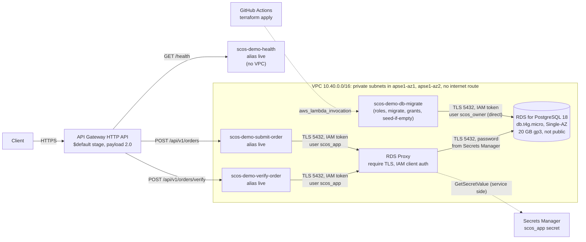
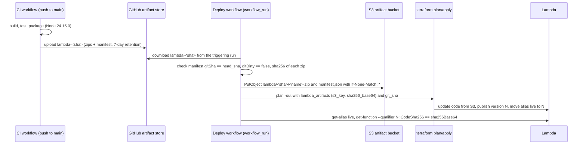
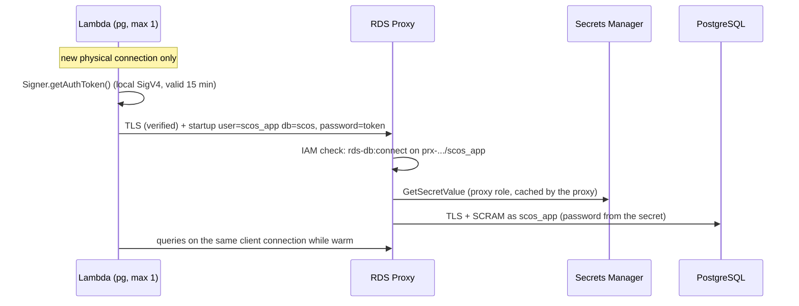
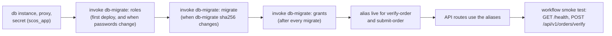

# Lambda deployment and connection pooling (#14)

This is the design for the optional AWS demonstration: how the three
per-endpoint Lambda functions are packaged, provisioned with Terraform,
deployed by GitHub Actions, connected to PostgreSQL through RDS Proxy, migrated,
costed and torn down. It is the input to #15 (Terraform and the deployment
pipeline) and lists what #16 (hosted deployment) still needs approved.

Nothing here provisions resources or authorizes spending. Every statement
marked **hosted evidence** is a design expectation, not a verified fact; #16
must record the evidence, and missing evidence is not a pass.

## Contents

1. [Decisions recorded](#1-decisions-recorded)
2. [Architecture](#2-architecture)
3. [Lambda artifacts](#3-lambda-artifacts)
4. [Terraform layout, inputs and outputs](#4-terraform-layout-inputs-and-outputs)
5. [Remote state and one-time bootstrap](#5-remote-state-and-one-time-bootstrap)
6. [Networking](#6-networking)
7. [Identities and IAM database authentication](#7-identities-and-iam-database-authentication)
8. [Connection budget and pooling](#8-connection-budget-and-pooling)
9. [Warehouse-lock contention and burst behaviour](#9-warehouse-lock-contention-and-burst-behaviour)
10. [Migrations and seed](#10-migrations-and-seed)
11. [Cost estimate](#11-cost-estimate)
12. [Teardown](#12-teardown)
13. [Telemetry (#17) on Lambda](#13-telemetry-17-on-lambda)
14. [Inputs for #15](#14-inputs-for-15)
15. [Remaining provisioning approvals for #16](#15-remaining-provisioning-approvals-for-16)
16. [Hosted evidence checklist for #16](#16-hosted-evidence-checklist-for-16)
17. [Sources](#17-sources)

### Acceptance criteria of #14

| #14 acceptance criterion                                                                                                      | Where                                                                                                                                                                                  |
| ----------------------------------------------------------------------------------------------------------------------------- | -------------------------------------------------------------------------------------------------------------------------------------------------------------------------------------- |
| Package the Hono composition for the Lambda runtime, Prisma included, smoke-tested offline                                    | [3](#3-lambda-artifacts) (code and tests in `apps/api/src/lambda/`, `apps/api/scripts/package-lambda.mjs`)                                                                             |
| Terraform + GitHub Actions; artifact identity, inputs/outputs, remote state (shared R2 backend), locking, recovery, bootstrap | [3.2](#32-artifact-identity-and-promotion), [4](#4-terraform-layout-inputs-and-outputs), [5](#5-remote-state-and-one-time-bootstrap)                                                   |
| Region, hosting/sizing, access, networking, connection budgets, costs, teardown                                               | [1](#1-decisions-recorded), [6](#6-networking), [7](#7-identities-and-iam-database-authentication), [8](#8-connection-budget-and-pooling), [11](#11-cost-estimate), [12](#12-teardown) |
| Pooling, warm reuse, Lambda connection demand, warehouse-lock contention                                                      | [8](#8-connection-budget-and-pooling), [9](#9-warehouse-lock-contention-and-burst-behaviour)                                                                                           |
| IAM DB auth: both hops, fresh tokens, role permissions, TLS, driver verification; separate identities                         | [7](#7-identities-and-iam-database-authentication), [16](#16-hosted-evidence-checklist-for-16)                                                                                         |
| Migration and seed without resetting stock at startup                                                                         | [10](#10-migrations-and-seed)                                                                                                                                                          |
| Inputs for #15 and remaining approvals for #16; no invented budget                                                            | [14](#14-inputs-for-15), [15](#15-remaining-provisioning-approvals-for-16), [11](#11-cost-estimate)                                                                                    |
| Environment validation at Lambda init, including #17's conditional telemetry                                                  | [3.3](#33-runtime-configuration), [13](#13-telemetry-17-on-lambda)                                                                                                                     |

## 1. Decisions recorded

Decided by the user on 2026-09-19, by choosing among options presented during
planning (the database option read "RDS for PostgreSQL db.t4g.micro, single-AZ,
20 GB gp3"):

- Region **ap-southeast-1** (Singapore).
- **Amazon RDS for PostgreSQL**, `db.t4g.micro`, Single-AZ, 20 GB gp3, behind
  **RDS Proxy**. This settles the database choice in the Stack
  bullet of [design decisions](../design-decisions.md#agreed-scope-and-constraints).
- Lambda to proxy: **IAM database authentication**. Proxy to database: a
  **Secrets Manager** secret (standard IAM authentication, not end-to-end IAM).
- Exposure: one **API Gateway HTTP API** (payload format 2.0) with three routes,
  each to its own function: `GET /health`, `POST /api/v1/orders/verify`,
  `POST /api/v1/orders`. $1.25 per million requests in ap-southeast-1, no
  fixed fee (price list published 2026-09-11).
- **Terraform** for infrastructure and **GitHub Actions** for deployment.
- The **monthly budget is not specified.** This document gives an itemized
  estimate ([11](#11-cost-estimate)); approving a budget is a #16 item.

Consequences checked against AWS documentation:

- The schema needs PostgreSQL 18 (`uuidv7()`). RDS for PostgreSQL 18 is
  available (18.6 as of August 2026), and RDS Proxy supports RDS for PostgreSQL
  18 in Asia Pacific (Singapore). Whether `db.t4g.micro` is orderable for the
  chosen 18.x minor version in ap-southeast-1 needs
  `aws rds describe-orderable-db-instance-options` (authenticated; #16).
- End-to-end IAM (proxy to database with IAM, no secret; `DefaultAuthScheme =
IAM_AUTH`) now exists for RDS for PostgreSQL. It is recorded as an
  alternative only ([7.4](#74-alternative-not-chosen-end-to-end-iam)); the
  decision above stands.

## 2. Architecture



- `health` needs no database and runs outside the VPC.
- `verify-order` and `submit-order` run in the private subnets and reach only
  the proxy.
- `db-migrate` is a fourth function, not part of the three-function API
  contract; #15 adds it ([10](#10-migrations-and-seed)). It connects directly
  to the instance, not through the proxy.
- There is no NAT gateway, no internet gateway, no VPC endpoint and no public
  IPv4 address in the design ([6](#6-networking)).

## 3. Lambda artifacts

### 3.1 What the code provides

As implemented in `apps/api`:

| Item             | Value                                                                                                                                                                                                                                                                                                                                                      |
| ---------------- | ---------------------------------------------------------------------------------------------------------------------------------------------------------------------------------------------------------------------------------------------------------------------------------------------------------------------------------------------------------- |
| Runtime          | `nodejs24.x`, `arm64`                                                                                                                                                                                                                                                                                                                                      |
| Handler          | `index.handler` in every artifact                                                                                                                                                                                                                                                                                                                          |
| Entry points     | `apps/api/src/lambda/{health,verify-order,submit-order}.ts`, listed once in `apps/api/build.config.mjs` (`LAMBDA_FUNCTIONS`)                                                                                                                                                                                                                               |
| Bundle           | `pnpm --filter @scos/api build` (esbuild, `apps/api/build.mjs`) writes `apps/api/dist/lambda/<name>/index.mjs` plus a source map. Workspace packages, Hono, pg, Prisma (its query compiler WASM is inlined as JavaScript), Zod and `@aws-sdk/rds-signer` are bundled; only `pg-native` is external and unused. The health bundle imports no database code. |
| Zip and manifest | `pnpm package:lambda` at the root (Turbo builds first, then runs `apps/api/scripts/package-lambda.mjs [--out-dir <dir>]`) writes `apps/api/dist/lambda/<name>.zip` and `manifest.json`                                                                                                                                                                     |
| Sizes            | About 0.39 MB (`health`) and 4.8 MB each (`verify-order`, `submit-order`), source maps included. `NODE_OPTIONS=--enable-source-maps` is optional and unset.                                                                                                                                                                                                |
| Offline proof    | The zips were run from a temporary directory with no `node_modules` against a migrated PostgreSQL: Prisma needs no engine files on Lambda.                                                                                                                                                                                                                 |
| Determinism      | Entries sorted, fixed 1980 timestamps, mode 0644, deflate level 9. Byte-identical zips need the same Node.js (CI pins 24.15.0) because compression uses Node's bundled zlib.                                                                                                                                                                               |
| Configuration    | `apps/api/src/lambda/config.ts`; parsed once per execution environment at module initialization ([3.3](#33-runtime-configuration))                                                                                                                                                                                                                         |
| Pool             | `apps/api/src/lambda/pool.ts`: `max: 1`, `idleTimeoutMillis: 0`, bounded `connectionTimeoutMillis` (5 s), IAM token per new connection, TLS verified                                                                                                                                                                                                       |

`manifest.json` (schema version 1):

```json
{
  "schemaVersion": 1,
  "gitSha": "<40-hex commit>",
  "gitDirty": false,
  "runtime": "nodejs24.x",
  "architecture": "arm64",
  "functions": [
    {
      "name": "submit-order",
      "artifact": "submit-order.zip",
      "handler": "index.handler",
      "runtime": "nodejs24.x",
      "architecture": "arm64",
      "files": ["index.mjs", "index.mjs.map"],
      "bytes": 0,
      "sha256": "<hex>",
      "sha256Base64": "<base64, Lambda CodeSha256 / Terraform source_code_hash form>"
    }
  ]
}
```

Points #15 and #16 must take into account:

- The deploy job must reject a manifest with `gitDirty: true` or a `gitSha`
  different from the commit being deployed.
- `DATABASE_AUTH_MODE` defaults to `password`. The hosted configuration must
  set `iam` explicitly; in `password` mode the pool does not enforce TLS.
- No `db-migrate` artifact exists; it is an input for #15.
- `/openapi.json` and `/docs` are served only by the combined local app. The
  three-route API does not expose them, but #16's QA acceptance lists hosted
  OpenAPI and interactive docs. See [open question 1](#open-questions).

### 3.2 Artifact identity and promotion

An artifact is identified by **(git SHA, function name, sha256)**. The same
bytes are built once and promoted; nothing rebuilds between CI and deploy.



- S3 key layout (artifact bucket `scos-demo-artifacts-<account-id>`):
  `lambda/<git-sha>/<name>.zip` and `lambda/<git-sha>/manifest.json`.
- Immutability: uploads use a conditional write (`If-None-Match: *`). If the
  key exists, the job compares its sha256 with the manifest and fails on a
  mismatch instead of overwriting. The bucket policy enforces this rather than
  trusting the uploader: S3 supports the `s3:if-none-match` condition key, so
  a statement denies `s3:PutObject` on `lambda/*` when
  `"Null": { "s3:if-none-match": "true" }`, with the `s3:ObjectCreationOperation`
  exemption AWS documents for multipart parts. A side effect AWS documents:
  `CopyObject` into that prefix is then refused, which the pipeline never
  needs. The deploy role has no `s3:DeleteObject` on `lambda/*`. Bucket
  versioning stays on as a safety net.
- Lambda: `publish = true` creates an immutable numbered version per code or
  configuration change. API Gateway integrations target the alias `live`,
  never `$LATEST`. `source_code_hash = sha256_base64` ties the plan to the
  artifact bytes.
- Rollback of code: the normal deploy starts only from `workflow_run` and
  its `lambda-<sha>` GitHub artifacts expire after 7 days, so rollback has its
  own manual workflow (`workflow_dispatch`, input: the earlier git SHA,
  environment `aws-demo`). It:
  - refuses to run when the deploy on/off variable is off, so it cannot
    reapply during a teardown;
  - shares the `deploy-aws-demo` concurrency group (no cancel-in-progress)
    with deploy, teardown and seed;
  - reads `lambda/<sha>/manifest.json` and the three API zips from S3 and
    checks `gitSha` equals the input, `gitDirty` is `false`, and each zip's
    sha256;
  - takes the current `db-migrate` `s3_key` and `sha256_base64` from the
    `current_lambda_artifacts` output in state (4.3), so `db-migrate` does not
    change;
  - plans and applies with the **current** Terraform code; Terraform moves
    `live` back.

  Database changes are forward-only
  and are **not** rolled back with code ([10](#10-migrations-and-seed)). A
  rollback moves only the three API artifacts: `lambda_artifacts["db-migrate"]`
  stays at the current artifact, so no older `db-migrate` runs and its
  invocations are not retriggered. (An older `prisma migrate deploy` would
  find no migrations to apply, but the design does not rely on that.)

- Database recovery is separate from artifact rollback. Within the backup
  retention (1 day by default), RDS point-in-time restore creates a **new**
  instance; recovering means registering it as the proxy's target (or
  pointing the stack at it through Terraform and importing it) and then
  retiring the old instance. Data written after the restore point is lost.
  The new instance has a new `DbiResourceId`, so the `db-migrate` role's
  `rds-db:connect` resource must change to it; this is automatic when the
  policy is derived from the imported instance's `resource_id` in Terraform.
  #16 decides whether a longer retention is worth its cost.

### 3.3 Runtime configuration

Validated with the #11 Zod helpers (`parseEnvironment`) once per execution
environment, at module initialization, before any pool or Prisma client is
built. A failure throws `LambdaConfigurationError` whose message is only
`NAME: reason` lines; values are never included. Lambda reports it as an init
failure (`Runtime.*` init error) and the invocation returns 5xx through API
Gateway, so a misconfigured function never serves a request. Schema
validation is not a connectivity check: a valid but unreachable
`DATABASE_URL` still initializes, and `health` never touches the database.

| Function       | Variable             | Value in the hosted demo                                                                                                                                                                                                                                                |
| -------------- | -------------------- | ----------------------------------------------------------------------------------------------------------------------------------------------------------------------------------------------------------------------------------------------------------------------- |
| `health`       | none                 |                                                                                                                                                                                                                                                                         |
| verify, submit | `DATABASE_URL`       | `postgresql://scos_app@<proxy-endpoint>:5432/scos`: proxy host name, user, database. In `iam` mode it must have a user and database name and no password or query parameters (so no `sslmode`); an IPv6 literal host and port 0 are rejected; the port defaults to 5432 |
| verify, submit | `DATABASE_AUTH_MODE` | `iam` (required explicitly; the default is `password`)                                                                                                                                                                                                                  |
| verify, submit | `AWS_REGION`         | Set by Lambda (`ap-southeast-1`); required in `iam` mode, format-checked in `password` mode. Terraform must not set it (reserved).                                                                                                                                      |
| all            | telemetry            | Not wired yet: `withLambdaTelemetryEnvironment` in `apps/api/src/lambda/telemetry.ts` (re-exported by `config.ts`) is the #17 extension point ([13](#13-telemetry-17-on-lambda))                                                                                        |

None of these values is secret. They are plain Lambda environment variables,
encrypted at rest with the AWS managed Lambda key.

## 4. Terraform layout, inputs and outputs

### 4.1 Layout

```text
infra/aws/                   # the stack GitHub Actions plans and applies
  main.tf  variables.tf  outputs.tf  versions.tf  .terraform.lock.hcl
  backend/demo.s3.tfbackend  # committed partial backend config (section 5.1)
  env/demo.tfvars            # non-secret inputs for the demo environment
  bootstrap/                 # once, by a human administrator (section 5.3)
    main.tf  variables.tf  outputs.tf  versions.tf  .terraform.lock.hcl
    backend/bootstrap.s3.tfbackend
  modules/
    network/                 # VPC, 2 private subnets, route table, security groups
    database/                # parameter group, subnet group, instance, scos_app secret
    proxy/                   # proxy role, proxy, default target group, target
    lambda-function/         # role, log group, function (S3 code), version, alias, optional VPC config
    http-api/                # API, $default stage, access logs, routes, integrations, permissions
    db-migrate/              # migration function and its aws_lambda_invocation steps
```

- Pin Terraform (`required_version = "~> 1.16.0"`; 1.16.3 was current on
  2026-08-26) and providers with exact versions in `versions.tf`
  (`hashicorp/aws` 6.x, 6.65.0 current on 2026-09-16; `hashicorp/random`).
  Commit `.terraform.lock.hcl` with hashes for `linux_amd64` and
  `darwin_arm64` (`terraform providers lock -platform=...`).
- One environment, `demo`. Environments are separated by state key: a
  second environment is another `backend/<env>.s3.tfbackend` (key
  `scos/aws/<env>/terraform.tfstate`), `env/<env>.tfvars` and GitHub
  environment, with the same code.
- Tag everything through the provider's `default_tags`:
  `project = scos`, `environment = demo`, `managed-by = terraform`,
  `git-sha = <sha>` (on functions only, to avoid churn elsewhere).

### 4.2 Inputs of `infra/aws`

| Name                                      | Type                                                                                                                                                  | Default / demo value                                                                                                 |
| ----------------------------------------- | ----------------------------------------------------------------------------------------------------------------------------------------------------- | -------------------------------------------------------------------------------------------------------------------- |
| `aws_region`                              | `string`                                                                                                                                              | `"ap-southeast-1"`                                                                                                   |
| `name_prefix`                             | `string`                                                                                                                                              | `"scos-demo"`                                                                                                        |
| `git_sha`                                 | `string` (validated: 40 hex)                                                                                                                          | from the workflow                                                                                                    |
| `artifact_bucket`                         | `string`                                                                                                                                              | bootstrap output                                                                                                     |
| `lambda_artifacts`                        | `map(object({ s3_key = string, sha256_base64 = string }))`                                                                                            | keys `health`, `verify-order`, `submit-order`, `db-migrate`                                                          |
| `vpc_cidr`                                | `string`                                                                                                                                              | `"10.40.0.0/16"`                                                                                                     |
| `private_subnet_cidrs`                    | `list(string)`                                                                                                                                        | `["10.40.1.0/24", "10.40.2.0/24"]`                                                                                   |
| `availability_zone_ids`                   | `list(string)`                                                                                                                                        | `["apse1-az1", "apse1-az2"]` (AZ IDs, not names)                                                                     |
| `db_engine_version`                       | `string`                                                                                                                                              | `"18.6"` (confirm orderable, #16)                                                                                    |
| `db_instance_class`                       | `string`                                                                                                                                              | `"db.t4g.micro"`                                                                                                     |
| `db_allocated_storage_gb`                 | `number`                                                                                                                                              | `20` (gp3, no provisioned IOPS/throughput, autoscaling off)                                                          |
| `db_name`                                 | `string`                                                                                                                                              | `"scos"`                                                                                                             |
| `db_backup_retention_days`                | `number`                                                                                                                                              | `1`                                                                                                                  |
| `db_deletion_protection`                  | `bool`                                                                                                                                                | `true` (set `false` only in the teardown change)                                                                     |
| `db_final_snapshot`                       | `bool`                                                                                                                                                | `true` (#16 decides; see [12](#12-teardown))                                                                         |
| `db_idle_in_transaction_timeout_ms`       | `number`                                                                                                                                              | `30000` (parameter group backstop; above the 15 s transaction timeout)                                               |
| `proxy_max_connections_percent`           | `number`                                                                                                                                              | `50`                                                                                                                 |
| `proxy_max_idle_connections_percent`      | `number`                                                                                                                                              | `10`                                                                                                                 |
| `proxy_connection_borrow_timeout_seconds` | `number`                                                                                                                                              | `5`                                                                                                                  |
| `proxy_idle_client_timeout_seconds`       | `number`                                                                                                                                              | `600` (default 1800; see 8.4)                                                                                        |
| `lambda_memory_mb`                        | `map(number)`                                                                                                                                         | `health = 128`, `verify-order = 512`, `submit-order = 512`, `db-migrate = 1024`                                      |
| `lambda_timeout_seconds`                  | `map(number)`                                                                                                                                         | `health = 3`, `verify-order = 10`, `submit-order = 30`, `db-migrate = 300`                                           |
| `lambda_reserved_concurrency`             | `map(number)`                                                                                                                                         | `verify-order = 10`, `submit-order = 5`, `db-migrate = 1` (health unreserved)                                        |
| `api_throttling`                          | `object({ default_rate = number, default_burst = number, verify_rate = number, verify_burst = number, submit_rate = number, submit_burst = number })` | `{ default_rate = 50, default_burst = 20, verify_rate = 40, verify_burst = 10, submit_rate = 10, submit_burst = 5 }` |
| `log_retention_days`                      | `number`                                                                                                                                              | `14`                                                                                                                 |
| `telemetry`                               | `object({ enabled = bool })` placeholder for #17                                                                                                      | `{ enabled = false }`                                                                                                |

No input carries a password. The database master and `scos_app` passwords are
`random_password` resources inside the stack ([7.3](#73-database-users-and-grants)).

### 4.3 Outputs of `infra/aws`

| Name                       | Type                                                       | Purpose                                                           |
| -------------------------- | ---------------------------------------------------------- | ----------------------------------------------------------------- |
| `api_endpoint`             | `string`                                                   | Base URL for smoke tests and QA                                   |
| `function_names`           | `map(string)`                                              | Per endpoint                                                      |
| `function_live_versions`   | `map(string)`                                              | Version behind alias `live`; checked against the manifest         |
| `proxy_endpoint`           | `string`                                                   | Host in `DATABASE_URL`                                            |
| `proxy_resource_id`        | `string`                                                   | `prx-...`, for IAM policy review                                  |
| `db_instance_identifier`   | `string`                                                   | Teardown and verification                                         |
| `db_resource_id`           | `string`                                                   | `db-...`, for IAM policy review                                   |
| `log_group_names`          | `map(string)`                                              | Evidence collection                                               |
| `migration_summary`        | `string`                                                   | Non-sensitive result of the last migration invocation             |
| `current_lambda_artifacts` | `map(object({ s3_key = string, sha256_base64 = string }))` | What is deployed now; read by the rollback and teardown workflows |

Nothing sensitive is output. Export only what the workflow and #16 need.

## 5. Remote state and one-time bootstrap

State follows #15's **Terraform state (shared R2 backend)** section: one
private Cloudflare R2 bucket holds the state of both deployment stacks, each
under its own key with its own lock.

| Stack                          | Code                   | State key                                 |
| ------------------------------ | ---------------------- | ----------------------------------------- |
| AWS (#15, this design)         | `infra/aws/`           | `scos/aws/<env>/terraform.tfstate`        |
| AWS bootstrap (5.3)            | `infra/aws/bootstrap/` | `scos/aws/bootstrap/terraform.tfstate`    |
| Cloudflare + PlanetScale (#28) | `infra/cloudflare/`    | `scos/cloudflare/<env>/terraform.tfstate` |

### 5.1 Backend

The root module declares an empty `backend "s3" {}`. The non-secret settings
are a committed partial configuration per stack and environment,
`infra/aws/backend/demo.s3.tfbackend`:

```hcl
bucket                      = "<shared state bucket>"
key                         = "scos/aws/demo/terraform.tfstate"
region                      = "auto"
endpoints                   = { s3 = "https://<cloudflare-account-id>.r2.cloudflarestorage.com" }
use_path_style              = true
use_lockfile                = true
skip_credentials_validation = true
skip_region_validation      = true
skip_requesting_account_id  = true
skip_metadata_api_check     = true
skip_s3_checksum            = true
```

- `terraform init -backend-config=backend/demo.s3.tfbackend` plus the
  credentials below. There is no `encrypt` or `kms_key_id`: R2 encrypts every
  object at rest, and there is no KMS key and no DynamoDB table.
- **Credentials** are the R2 access key ID and secret of a bucket-scoped R2
  API token, stored only as secrets of the GitHub environment `aws-demo`.
  They must not collide with the AWS provider's OIDC credentials, which also
  use the `AWS_*` variables. #15 chooses and proves one of: (a) a backend
  configuration file generated at run time in `$RUNNER_TEMP` with
  `access_key`/`secret_key` from those secrets, or (b) the AWS provider using
  `assume_role_with_web_identity` with a token file while the R2 keys occupy
  `AWS_ACCESS_KEY_ID`/`AWS_SECRET_ACCESS_KEY`. With (a), `.terraform/` and
  saved plans also contain the R2 credentials; with (b), which uses only
  environment variables, neither stores the R2 keys. Neither leaves the job in any
  case, because saved plans also hold the database passwords.
- **Locking** uses the S3-native lock file (`use_lockfile = true`, a
  `terraform.tfstate.tflock` object next to each state; introduced in
  Terraform 1.10, DynamoDB locking deprecated). It relies on conditional
  writes; R2's `PutObject` implements `If-None-Match`. #15 must prove on R2
  that a second concurrent apply against the same key is rejected
  (`-lock-timeout=0` fails with a lock error) and that an apply on
  `scos/aws/demo` and one on `scos/cloudflare/<env>` run at the same time
  without blocking each other. **If R2 locking cannot be proven, stop and
  escalate; never run with `-lock=false`.**
- **The state is a secret.** It holds the database passwords
  ([7.3](#73-database-users-and-grants)) and the `db-migrate` invocation
  input. The bucket is private: no public access, no `r2.dev` URL, no custom
  domain. Outputs carrying anything sensitive are marked `sensitive`; state
  and plans are never committed or printed.
- **Accepted risk (from #15):** R2 API tokens scope to a bucket, not a key
  prefix, so the AWS track's token can read and write the Cloudflare stack's
  state (PlanetScale role passwords, Hyperdrive origin credentials) and the
  reverse. Mitigations: a separate token per stack (revocable separately),
  held only by trusted jobs in each stack's protected environment. If #16 does
  not accept the risk, use separate buckets.
- **Saved plans** contain the passwords and backend credentials in plaintext.
  Plan and apply run in the **same job**; the plan file is never stored
  anywhere: not in GitHub artifacts, logs, comments or the state bucket.
  Adding an approval pause between plan and apply would need a new design
  for storing plans.
- **No cloud plan on pull requests by default.** A pull-request job that can
  read state can read the passwords, and a same-repository branch can change
  the workflow it runs. PRs therefore run `fmt -check` and `validate` only and
  say the cloud plan was skipped; plans run in the deploy job on `main`. PR
  plans (a read-only `scos-demo-plan` role and an `aws-demo-plan` environment
  with its own R2 token) are added only if #16 accepts that risk.

### 5.2 State recovery

R2 does **not** implement object versioning (`PutBucketVersioning` and
`GetBucketVersioning` are listed as unimplemented), so recovery is a bounded
backup:

- Before every `apply` and every `destroy`, the deploy job copies the current
  state object server side (S3 `CopyObject` against the R2 endpoint, nothing
  downloaded or printed) to
  `scos/aws/<env>/backups/<UTC timestamp>-<run id>-<git sha>.tfstate`.
- An R2 object lifecycle rule, set at bootstrap, deletes objects under
  `scos/aws/<env>/backups/` after 30 days. Backups are therefore bounded to 30
  days of deployments and have the same access as the state.
- Restore: stop deployments (step 1 of [12](#12-teardown)), confirm no
  `.tflock` object exists, copy the chosen backup over
  `scos/aws/<env>/terraform.tfstate` with `CopyObject`, then run `terraform
plan -refresh-only` and review the drift before any apply. Resources created
  after the backup are not in the restored state and must be imported or
  removed by hand.
- #15 rehearses one backup and restore against a throwaway key.

### 5.3 Bootstrap (once, by a human)

Two steps, both outside the deploy pipeline, so there is no cycle:

1. **R2 bucket and tokens, outside Terraform** (Cloudflare account
   administrator, dashboard or Wrangler): create the private bucket (shared
   with #28 if it does not exist yet), the lifecycle rule for
   `scos/aws/<env>/backups/`, a bucket-scoped Object Read & Write token for
   the AWS track's CI, and a separate short-lived one for the administrator
   (step 2). Store its key ID and secret as `aws-demo` environment
   secrets (`R2_STATE_ACCESS_KEY_ID`, `R2_STATE_SECRET_ACCESS_KEY`). The AWS
   track therefore **depends on a Cloudflare account** for its state.
2. **`infra/aws/bootstrap`, with Terraform** (AWS account administrator, with
   short-lived IAM Identity Center credentials, from a workstation; state in
   R2 under `scos/aws/bootstrap/terraform.tfstate`). For the backend, the
   workstation uses its own R2 API token, created in step 1 for the
   administrator, bucket-scoped, Object Read & Write, with a short expiry. It
   is kept out of the shell history and not shared with CI; the AWS
   credentials come from Identity Center, so the two do not collide if the R2
   keys are passed with a local, uncommitted backend configuration file
   (`-backend-config=<file>` with `access_key`/`secret_key`).

| Resource                                              | Notes                                                                                                                                                                                                                                                                                                                  |
| ----------------------------------------------------- | ---------------------------------------------------------------------------------------------------------------------------------------------------------------------------------------------------------------------------------------------------------------------------------------------------------------------- |
| Artifact bucket `scos-demo-artifacts-<account>`       | Versioning, SSE-S3, public access blocked, TLS-only policy, noncurrent versions expire after 30 days                                                                                                                                                                                                                   |
| GitHub OIDC provider                                  | URL `https://token.actions.githubusercontent.com`, client ID `sts.amazonaws.com`                                                                                                                                                                                                                                       |
| Role `scos-demo-deploy`                               | Trust below, environment `aws-demo`; manages `scos-demo-*` resources except IAM; IAM limited as in [7.1](#71-identities): roles `scos-demo-fn-*` with the function boundary, passed only to `lambda.amazonaws.com`, and `scos-demo-proxy` with the proxy boundary, passed only to `rds.amazonaws.com`; artifact upload |
| Role `scos-demo-plan` (only if PR plans are approved) | Same trust shape with `environment:aws-demo-plan`; read-only describe permissions                                                                                                                                                                                                                                      |

Trust policy for the deploy role. This repository was created on 2026-09-18,
after GitHub switched new repositories to the immutable subject format, and
its OIDC settings report `use_immutable_subject: true` with prefix
`repo:bonanaaaaaa@1984759/scos@1375534759`:

```json
{
  "Effect": "Allow",
  "Principal": {
    "Federated": "arn:aws:iam::<account-id>:oidc-provider/token.actions.githubusercontent.com"
  },
  "Action": "sts:AssumeRoleWithWebIdentity",
  "Condition": {
    "StringEquals": {
      "token.actions.githubusercontent.com:aud": "sts.amazonaws.com",
      "token.actions.githubusercontent.com:sub": "repo:bonanaaaaaa@1984759/scos@1375534759:environment:aws-demo"
    }
  }
}
```

- A job that names an environment gets `...:environment:<name>` as its subject
  instead of the branch ref, so "main only" is enforced by the GitHub
  environment's deployment branch policy (`main`), which Pro plans support for
  private repositories. The same policy restricts who can use the R2 secrets.
- Fork pull requests get no OIDC token and no environment secrets.
- Use `StringEquals`, never `StringLike` with wildcards on `sub`.
- The repository already has environments `pr` and `prod` with no protection
  rules, unused by any workflow. #15 should use dedicated names as above or
  document the reuse.
- Record the bootstrap outputs (`artifact_bucket`, `oidc_provider_arn`,
  `deploy_role_arn`) as `aws-demo` environment variables; none is sensitive.

## 6. Networking

| Element        | Design                                                                                                                                                                                                                                                            |
| -------------- | ----------------------------------------------------------------------------------------------------------------------------------------------------------------------------------------------------------------------------------------------------------------- |
| VPC            | `10.40.0.0/16`, DNS hostnames and resolution on (the proxy endpoint is a DNS name)                                                                                                                                                                                |
| Subnets        | Two private `/24`s in `apse1-az1` and `apse1-az2`. RDS Proxy requires subnets in at least two AZs even for a Single-AZ instance. Keep at least 10 free addresses per subnet for the proxy (its minimum for `db.*.xlarge` or smaller) plus Lambda Hyperplane ENIs. |
| Routes         | Local only. No internet gateway, NAT gateway or VPC endpoint.                                                                                                                                                                                                     |
| `sg-lambda-db` | verify and submit. Egress TCP 5432 to `sg-proxy` only. No ingress.                                                                                                                                                                                                |
| `sg-proxy`     | Ingress TCP 5432 from `sg-lambda-db`. Egress TCP 5432 to `sg-db`.                                                                                                                                                                                                 |
| `sg-db`        | Ingress TCP 5432 from `sg-proxy` and `sg-migrate`. No egress rules needed.                                                                                                                                                                                        |
| `sg-migrate`   | Egress TCP 5432 to `sg-db` only.                                                                                                                                                                                                                                  |
| Database       | `publicly_accessible = false`, storage encrypted (AWS managed `aws/rds` key), `rds.force_ssl = 1`                                                                                                                                                                 |
| Proxy          | `require_tls = true` (TLS required for client connections to the proxy), `engine_family = "POSTGRESQL"`, one auth entry with `iam_auth = "REQUIRED"`. A proxy cannot be public.                                                                                   |
| `health`       | Not in the VPC                                                                                                                                                                                                                                                    |

Why no NAT or endpoint is needed:

- **IAM token signing is local.** `@aws-sdk/rds-signer` presigns with the
  execution role's credentials, which Lambda provides in the environment; it
  makes no network call.
- **Logs** leave through the Lambda service, not the function's ENIs.
- **The proxy reads its secret on the AWS side.** The RDS Proxy network
  prerequisites list only a VPC with two subnets in different AZs; they do not
  require a NAT gateway or a Secrets Manager endpoint for the proxy.
  **Hosted evidence:** the target must reach `AVAILABLE` in a VPC with neither.
- **The migration function** authenticates with an IAM token and gets its
  bootstrap input from the invocation payload, so it needs no AWS API access
  from inside the VPC ([10](#10-migrations-and-seed)).
- **OTLP export (#17)** would need egress. That is a cost decision
  ([13](#13-telemetry-17-on-lambda)); it is off by default.

Public IPv4: none. API Gateway and the proxy are AWS managed; nothing in the
account holds a public address, so the $0.005/hour IPv4 charge does not
apply. A NAT gateway would add one ($3.65/month) on top of its own charges.

TLS on every hop:

| Hop             | TLS and verification                                                                                                                                                                                                                                                                                                                                                                                                     |
| --------------- | ------------------------------------------------------------------------------------------------------------------------------------------------------------------------------------------------------------------------------------------------------------------------------------------------------------------------------------------------------------------------------------------------------------------------ |
| Client to API   | HTTPS, AWS managed certificate on the default `execute-api` domain                                                                                                                                                                                                                                                                                                                                                       |
| Lambda to proxy | Required by the proxy: `RequireTLS` "specifies whether Transport Layer Security (TLS) encryption is required for connections to the proxy" (CreateDBProxy API), and IAM auth needs TLS anyway. The pool uses `ssl: { rejectUnauthorized: true }` with host name verification against Node's bundled roots: the proxy presents an ACM certificate chaining to Amazon Trust Services roots, so no RDS CA bundle is needed. |
| Proxy to DB     | Enforced by `rds.force_ssl = 1` on the instance, which refuses non-TLS connections; a proxy target in `AVAILABLE` state is the evidence that the proxy connects over TLS. (`require_tls` is defined in the API for client connections only; the RDS Proxy concepts page describes the console setting as covering proxy to database too, so this design does not rely on it for this hop.)                               |
| Migrate to DB   | `sslmode=verify-full` equivalent with the RDS CA bundle for ap-southeast-1 packaged in the migration artifact (direct instance connections use the RDS CA, not ACM)                                                                                                                                                                                                                                                      |

## 7. Identities and IAM database authentication

### 7.1 Identities

> **Known open review findings (parked with the AWS deployment, 2026-09-19).**
> Resolve these before #15 builds the deploy role from the statement table
> below:
>
> 1. The table stops Terraform from managing the roles. `iam:GetRolePolicy` is
>    missing, so plans fail after the first apply. `iam:DeleteRole` is
>    conditioned on `iam:PermissionsBoundary`, which it does not carry, so
>    teardown fails. Move `DeleteRole` and add `GetRolePolicy` (and optionally
>    `UpdateRole`/`UpdateRoleDescription`) to the unconditioned row.
> 2. The first apply in an account that has never used RDS needs
>    `iam:CreateServiceLinkedRole` for `rds.amazonaws.com`. Create the role in
>    the bootstrap, or allow that one action with `iam:AWSServiceName`.
> 3. Not blocking: `iam:UpdateAssumeRolePolicy` lets the deploy role make the
>    Lambda or proxy roles trust another account, so access can outlast a
>    revoked OIDC trust. Document this as an accepted risk (with Access Analyzer
>    detection) or drop the permission.
> 4. Not blocking: approval 14's alternative also needs Secrets Manager access
>    in the function boundary, port 443 egress from `sg-migrate`, and a
>    `roles` trigger on `secret_string_wo_version`.

| Identity                  | Used by                          | Can do                                                                                       | Cannot do                                                             |
| ------------------------- | -------------------------------- | -------------------------------------------------------------------------------------------- | --------------------------------------------------------------------- |
| `scos-demo-deploy` (OIDC) | Deploy workflow                  | Manage the stack's resources, upload artifacts, invoke `db-migrate` through Terraform        | Connect to the database directly (no `rds-db:connect`); but see below |
| `scos-demo-plan` (OIDC)   | PR plans, only if approved (5.1) | Read-only describe                                                                           | Change resources; no state access by default                          |
| Lambda execution roles    | Each function, one role each     | Logs; VPC ENI management (verify, submit, migrate); `rds-db:connect` for exactly one DB user | Anything else; no Secrets Manager access                              |
| Database users            | Sessions in PostgreSQL           | See 7.3                                                                                      |                                                                       |

The separation is between the pipeline, the runtime and the database, not
protection against a compromised pipeline. Two limits to state plainly:

- **The deploy role effectively has `scos_owner` access**, and through the
  `roles` step the master password: it can change `db-migrate`'s code and
  invoke it, and the deploy job holds the R2 token for the state that stores
  the passwords.
- **It can create and pass roles.** Managing roles plus `iam:PassRole`
  would let it create a more privileged role and attach it to a function, so
  the role permissions below are bounded.

#15 creates two permissions boundaries in the bootstrap, each with an
explicit deny of all `iam:*`:

- `scos-demo-function-boundary`, for the Lambda roles `scos-demo-fn-<name>`:
  logs, VPC ENI actions, and `rds-db:connect` on
  `arn:aws:rds-db:ap-southeast-1:<account-id>:dbuser:*/scos_app` and
  `.../dbuser:*/scos_owner`. The bootstrap cannot know the `prx-`/`db-` IDs,
  so the boundary names the users only; the function policies name the real
  IDs. The wildcard also keeps working after a point-in-time restore
  ([3.2](#32-artifact-identity-and-promotion)). No Secrets Manager or KMS.
- `scos-demo-proxy-boundary`, for the one role `scos-demo-proxy`:
  `secretsmanager:GetSecretValue` on `scos-demo/db/*` and `kms:Decrypt` with
  `kms:ViaService = secretsmanager.ap-southeast-1.amazonaws.com`.

The deploy role's broad "manage `scos-demo-*` resources" grant excludes
`iam:*`. Its IAM permissions are only these statements:

| Effect | Actions                                                                                                                                    | Resource                                           | Condition                                                         |
| ------ | ------------------------------------------------------------------------------------------------------------------------------------------ | -------------------------------------------------- | ----------------------------------------------------------------- |
| Allow  | `CreateRole`, `PutRolePermissionsBoundary`, `AttachRolePolicy`, `PutRolePolicy`, `DetachRolePolicy`, `DeleteRolePolicy`, `DeleteRole`      | `role/scos-demo-fn-*`                              | `iam:PermissionsBoundary` equals the function boundary ARN        |
| Allow  | the same                                                                                                                                   | `role/scos-demo-proxy`                             | `iam:PermissionsBoundary` equals the proxy boundary ARN           |
| Allow  | `GetRole`, `TagRole`, `UntagRole`, `ListRolePolicies`, `ListAttachedRolePolicies`, `ListInstanceProfilesForRole`, `UpdateAssumeRolePolicy` | `role/scos-demo-fn-*`, `role/scos-demo-proxy`      | none                                                              |
| Allow  | `PassRole`                                                                                                                                 | `role/scos-demo-fn-*`                              | `iam:PassedToService` equals `lambda.amazonaws.com`               |
| Allow  | `PassRole`                                                                                                                                 | `role/scos-demo-proxy`                             | `iam:PassedToService` equals `rds.amazonaws.com`                  |
| Deny   | `CreateRole`, `PutRolePermissionsBoundary`, `AttachRolePolicy`, `PutRolePolicy`                                                            | `role/scos-demo-fn-*`                              | `StringNotEquals` `iam:PermissionsBoundary` the function boundary |
| Deny   | the same                                                                                                                                   | `role/scos-demo-proxy`                             | `StringNotEquals` `iam:PermissionsBoundary` the proxy boundary    |
| Deny   | `DeleteRolePermissionsBoundary`                                                                                                            | `role/scos-demo-*`                                 | none                                                              |
| Deny   | `CreatePolicyVersion`, `DeletePolicy`, `SetDefaultPolicyVersion`, and all role changes                                                     | the two boundary policies, `role/scos-demo-deploy` | none                                                              |

The explicit denies follow AWS's documented pattern for delegating role
creation with a permissions boundary, so an allow elsewhere cannot bypass
them. Because `PassRole` is split by role name and service, the deploy role
cannot give the proxy role (which can read the secret) to a Lambda function.

Runtime role policy for verify and submit (the proxy resource ID, not the
instance ID):

```json
{
  "Effect": "Allow",
  "Action": "rds-db:connect",
  "Resource": "arn:aws:rds-db:ap-southeast-1:<account-id>:dbuser:prx-<proxy-resource-id>/scos_app"
}
```

The migration role gets the same action on
`arn:aws:rds-db:ap-southeast-1:<account-id>:dbuser:db-<DbiResourceId>/scos_owner`.
RDS Proxy supports no global condition context keys, so do not add
`aws:SourceVpc`-style conditions to these statements.

Proxy role (trusted by `rds.amazonaws.com`):

```json
[
  {
    "Effect": "Allow",
    "Action": "secretsmanager:GetSecretValue",
    "Resource": "arn:aws:secretsmanager:ap-southeast-1:<account-id>:secret:scos-demo/db/scos_app-*"
  },
  {
    "Effect": "Allow",
    "Action": "kms:Decrypt",
    "Resource": "arn:aws:kms:ap-southeast-1:<account-id>:key/<aws/secretsmanager key id>",
    "Condition": {
      "StringEquals": { "kms:ViaService": "secretsmanager.ap-southeast-1.amazonaws.com" }
    }
  }
]
```

### 7.2 Both hops



- **Fresh tokens.** pg calls the `password` function for every new physical
  connection, and `pool.ts` passes `() => signer.getAuthToken()`, so each
  connection authenticates with a new token. A token matters only during
  authentication; an established connection outlives its 15 minutes. Nothing
  caches or logs tokens.
- **No connection string in IAM mode.** Host, port, user and database are
  passed separately so pg cannot let an empty URL password or `sslmode`
  override the token function or `ssl`.
- **`scos_app` must not be granted `rds_iam`.** It authenticates to the
  database with its password through the proxy; AWS warns that mixing
  `rds_iam` and password authentication for one user causes connection
  instability. `scos_owner` is the opposite: `rds_iam`, no password.
- The proxy auth entry: `auth_scheme = "SECRETS"` (how the proxy
  authenticates to the database), `iam_auth = "REQUIRED"` (clients must use
  IAM), secret `scos-demo/db/scos_app` (JSON `{"username": "scos_app",
"password": ...}`). `client_password_auth_type` is the password method for
  **clients** (`UserAuthConfig` API); with `iam_auth = "REQUIRED"` it does not
  apply, so leave it at the PostgreSQL default. The proxy logs in to the
  database with the secret's password using whatever the database requires
  (SCRAM-SHA-256 by default).

### 7.3 Database users and grants

| User            | Created by                | Authentication                                   | Purpose                                                                                           |
| --------------- | ------------------------- | ------------------------------------------------ | ------------------------------------------------------------------------------------------------- |
| `scos_admin`    | RDS (master user)         | Password (`random_password`, in state only)      | `roles` step of `db-migrate` only: create roles, set passwords, database ownership                |
| `scos_owner`    | `db-migrate` `roles` step | IAM (`rds_iam`), no password; direct to instance | Owns database `scos` and every table; runs `prisma migrate deploy`, the table grants and the seed |
| `scos_app`      | `db-migrate` `roles` step | Password from the secret (proxy), no `rds_iam`   | Runtime DML through the proxy                                                                     |
| `rdsproxyadmin` | RDS Proxy                 | Managed                                          | Do not modify                                                                                     |

`scos_app`'s grants, derived from the SQL the persistence adapter issues
(`inventory-reader.ts`, `submission-store.ts`):

| Statement in the app                                                                             | Privilege needed                                                            |
| ------------------------------------------------------------------------------------------------ | --------------------------------------------------------------------------- |
| `SELECT id, latitude, longitude, stock FROM warehouses ORDER BY id` (verify)                     | `SELECT` on `warehouses`                                                    |
| `SELECT ... FROM warehouses ORDER BY id FOR UPDATE` (submit)                                     | `SELECT` and `UPDATE` on at least one column of `warehouses`                |
| `UPDATE warehouses SET stock = stock - $1 WHERE id = $2 AND stock >= $1`                         | `UPDATE (stock)`, `SELECT` (WHERE); the `updated_at` trigger needs no grant |
| `orders` `findUnique` by `submission_key`, reread by `id`                                        | `SELECT` on `orders`                                                        |
| `INSERT INTO orders ... RETURNING id`                                                            | `INSERT`, `SELECT` on `orders`                                              |
| nested `createMany` of allocations; allocations read with the Order                              | `INSERT`, `SELECT` on `order_allocations`                                   |
| `set_config('lock_timeout' / 'statement_timeout', ..., true)`, `SET TRANSACTION ISOLATION LEVEL` | none (user-settable)                                                        |

```sql
GRANT CONNECT ON DATABASE scos TO scos_app;
GRANT USAGE ON SCHEMA public TO scos_app;
GRANT SELECT, UPDATE (stock) ON warehouses TO scos_app;
GRANT SELECT, INSERT ON orders, order_allocations TO scos_app;
```

- No `DELETE`, `TRUNCATE`, sequence or `_prisma_migrations` access. IDs come
  from `uuidv7()` defaults, so there are no sequences.
- Grants are explicit per table and reapplied by the `grants` step (run by the table owner, `scos_owner`) after every
  migration. Default privileges are not used, so a new table gets no access
  until its migration's pull request adds the grant.
- `REVOKE CONNECT ON DATABASE scos FROM PUBLIC` is optional hardening; apply it
  only after checking that the proxy target stays healthy (the proxy's
  monitoring user must still connect).

### 7.4 Alternative not chosen: end-to-end IAM

With `default_auth_scheme = "IAM_AUTH"` the proxy authenticates to the
database with IAM (`rds-db:connect` in the proxy role, `GRANT rds_iam TO
scos_app`), removing the `scos_app` secret ($0.40/month), its password in
Terraform state, and the proxy's Secrets Manager dependency. It is recorded for
the #16 review only; the user decided on Secrets Manager.

### 7.5 Driver verification

Offline (developers): `apps/api/src/lambda/pool.test.ts` (a self-signed
certificate is rejected before any token is minted, `max: 1`),
`apps/api/test/lambda-artifacts.integration.test.ts` (the packaged artifacts
complete TLS with a trusted certificate, mint a fresh token per connection,
and reject a trusted certificate for another host name without sending a
token), and `config.test.ts` (sanitized configuration errors). Hosted checks are in [16](#16-hosted-evidence-checklist-for-16).

## 8. Connection budget and pooling

### 8.1 Database side

RDS sets PostgreSQL's default `max_connections` to
`LEAST({DBInstanceClassMemory/9531392}, 5000)`. `db.t4g.micro` has 1 GiB, so
the upper bound is 1,073,741,824 / 9,531,392 = **112**. `DBInstanceClassMemory`
excludes memory reserved for the OS and RDS processes, so the real value is
lower; this design assumes **80** and #16 records `SHOW max_connections`.

| Consumer                                         | Connections                                                                                         |
| ------------------------------------------------ | --------------------------------------------------------------------------------------------------- |
| Superuser and RDS reserved slots                 | about 3 to 5 (`SHOW superuser_reserved_connections`, `reserved_connections`)                        |
| RDS Proxy cap: `MaxConnectionsPercent = 50`      | 40 at `max_connections = 80` (56 at 112), including the proxy's own reserved monitoring connections |
| Proxy idle cap: `MaxIdleConnectionsPercent = 10` | 8 (11)                                                                                              |
| `db-migrate` (direct, `scos_owner`)              | 1 to 2 during a migration (Prisma schema engine and its advisory lock)                              |
| Operator headroom                                | the remainder, at least 30                                                                          |

### 8.2 Lambda side

| Function       | Reserved concurrency | Client connections to the proxy | Database connections                      |
| -------------- | -------------------- | ------------------------------- | ----------------------------------------- |
| `health`       | none (unreserved)    | 0                               | 0                                         |
| `verify-order` | 10                   | at most 10                      | borrowed per statement; expected unpinned |
| `submit-order` | 5                    | at most 5                       | at most 5; expected pinned (8.3)          |

- `max: 1` per execution environment: an environment runs one invocation at
  a time, so one connection is all it can use. The pool, the Prisma client and
  the connection are built at init and reused across warm invocations.
- Reserved concurrency bounds **active** environments only. Client
  connections also stay open, and pinned sessions keep their database
  connection, for environments that are frozen, reclaimed by Lambda without
  closing their socket, or left behind on a superseded version after a
  deploy. The proxy closes those only after `IdleClientTimeout`. So the
  pinned demand in any window of length T = `IdleClientTimeout` is roughly:

  pinned ≤ 5 (active submit) + 5 × (deploys within T) + (submit environments
  reclaimed or replaced within T)

  Verify connections are expected unpinned, so their idle client connections
  hold no database connection.

- With T = 600 s and deploys at least 10 minutes apart: about 5 + 5 + 5 = 15
  pinned, plus up to 10 active verify borrows, 25 in total, inside the proxy
  cap of 40 (about 30 with AWS's 30% headroom). With the default 1800 s,
  three deploys and normal churn in half an hour could reach 30 pinned before
  counting verify, at the cap. Hence the recommended `IdleClientTimeout` of
  **600 s** (range 300 to 600 s); see 8.4 for its cost. The cap, not Lambda,
  is the hard limit.
- Reserved concurrency needs account headroom: Lambda keeps at least 100 units
  unreserved, so reserving 16 (verify 10, submit 5, `db-migrate` 1) needs an
  account limit of at least 116. New
  accounts can have much lower limits. #16 must check
  `aws lambda get-account-settings` and request an increase if needed; without
  it, reserved concurrency cannot be set and the proxy cap plus API Gateway
  throttling are the only bounds.

### 8.3 Pinning assessment

RDS Proxy multiplexes at transaction boundaries and **pins** a PostgreSQL
session for, among other things, `SET` commands and "setting a parameter ...
using `SET` and `set_config`", `PREPARE`/`EXECUTE`/`DEALLOCATE`, session
advisory locks, temporary objects, and any statement over 16 KB. There are no
session pinning filters for PostgreSQL. A pinned session keeps its database
connection until the **client** connection closes.

| App behaviour                                                                                                                                                                                                     | Expected effect                                                                                                             |
| ----------------------------------------------------------------------------------------------------------------------------------------------------------------------------------------------------------------- | --------------------------------------------------------------------------------------------------------------------------- |
| Verify: one parameterless `SELECT` outside a transaction                                                                                                                                                          | No pinning                                                                                                                  |
| Prisma adapter-pg statements: `client.query({ name: undefined, text, values })`, so parameterized statements use the extended protocol with the **unnamed** statement; parameterless ones use the simple protocol | Not listed as a pinning condition (the list names SQL-level `PREPARE`/`EXECUTE`); expected no pinning. **Hosted evidence.** |
| Submit: `BEGIN`, then Prisma's `SET TRANSACTION ISOLATION LEVEL READ COMMITTED`                                                                                                                                   | A `SET` command: **likely pins**                                                                                            |
| Submit: `SELECT set_config('lock_timeout', ..., true), set_config('statement_timeout', ..., true)`                                                                                                                | Transaction-local, but the documentation names `set_config` without distinguishing: **likely pins**                         |
| Prisma migrate's `pg_advisory_lock`                                                                                                                                                                               | Would pin, but migrations connect directly, not through the proxy                                                           |

So the design assumes every `submit-order` environment that has served a
request holds one pinned database connection until its client connection
closes: 5 active ones plus stale ones, as counted in 8.2. #16 measures `DatabaseConnectionsCurrentlySessionPinned` while running
verify-only load, then submit load. If pinning must be removed later (a code
change for the backend owner, not decided here): drop the explicit isolation
level (READ COMMITTED is PostgreSQL's default) and move the two timeouts to
`ALTER ROLE scos_app SET lock_timeout/statement_timeout` or the proxy's
initialization query, which applies to every connection including verify.

### 8.4 Timeouts and frozen environments

| Setting                                             | Value                      | Reasoning                                                                                                                                                                                                                                                                                                                                                                                                                                                                                                                                           |
| --------------------------------------------------- | -------------------------- | --------------------------------------------------------------------------------------------------------------------------------------------------------------------------------------------------------------------------------------------------------------------------------------------------------------------------------------------------------------------------------------------------------------------------------------------------------------------------------------------------------------------------------------------------- |
| pg `connectionTimeoutMillis`                        | 5 s (code)                 | Covers TCP, TLS and IAM authentication to the proxy. A timeout is classified transient.                                                                                                                                                                                                                                                                                                                                                                                                                                                             |
| Proxy `ConnectionBorrowTimeout`                     | **5 s** (default 120 s)    | Borrowing happens when a statement or transaction starts, after the client connection exists, so the 5 s connect timeout does not bound it. 120 s would outlive the 30 s API Gateway limit. The error returned on a borrow timeout, and whether the submission classifier treats it as transient (503) or unknown (500), is **hosted evidence**.                                                                                                                                                                                                    |
| pg `idleTimeoutMillis`                              | 0, never (code)            | Timers cannot run while an environment is frozen; closing on thaw would only drop a healthy connection. See `pool.ts`.                                                                                                                                                                                                                                                                                                                                                                                                                              |
| Proxy `IdleClientTimeout`                           | **600 s** (default 1800 s) | Closes client connections of environments that are frozen, reclaimed or on superseded versions, and with them their pinned database connections (8.2). The cost: an environment idle for longer than this finds its connection closed on thaw, and the request that races the close fails with 500 or 503 (retry-safe with the same `submissionId`). A shorter timeout makes that more frequent; #16 records both the pinned count and the rate of these failures and tunes within 300 to 600 s. `pool.ts` keeps `idleTimeoutMillis: 0` either way. |
| Proxy client connection max life                    | 24 h (fixed by AWS)        | pg sets no `maxLifetimeSeconds`. An environment older than 24 h sees one closed connection; the request fails 500/503 and a retry with the same `submissionId` is safe (ADR 0004).                                                                                                                                                                                                                                                                                                                                                                  |
| Transaction: `maxWait` / `timeout` / `lock_timeout` | 5 s / 15 s / 10 s (code)   | Unchanged                                                                                                                                                                                                                                                                                                                                                                                                                                                                                                                                           |
| `idle_in_transaction_session_timeout`               | 30 s (parameter group)     | Backstop if a function dies mid-transaction; above the 15 s transaction timeout                                                                                                                                                                                                                                                                                                                                                                                                                                                                     |
| Lambda timeout, submit                              | 30 s                       | Equal to the HTTP API maximum integration timeout (30 s, not adjustable)                                                                                                                                                                                                                                                                                                                                                                                                                                                                            |

Risk to record: `maxWait` (5 s) applies to each `$transaction` attempt, so
the worst-case submission is about 5 s (the unlocked lookup's connection
wait) + 3 attempts × (5 s `maxWait` + 15 s `timeout`) ≈ 65 s, longer than
API Gateway's 30 s. In that case the client gets a 503
from API Gateway while the function may still commit. A retry with the same
`submissionId` returns the committed Order, so correctness holds; only the
first response is lost. Realistic lock waits are milliseconds (section 9), so
this needs a pathological stall. Shorter Lambda-specific submission timeouts
are a possible follow-up for the backend owner.

After a connection is lost, pg discards the broken client and the next query
opens a new connection with a new token. The request that races the close
can fail. Two outcomes were observed locally after the server side closed
the connection:

- A request that **races the close**, arriving before pg has noticed the
  closed socket: a reviewer's probe saw **verify return 500 once**, then 200
  on the next call. **Submit** recovers on its own through its
  transient-failure retry.
- A request that arrives **after pg has noticed** (the integration test waits
  for the terminated backend to disappear first): the first request
  **succeeded** in 3 of 3 runs, because pg had already discarded the client
  and opened a new connection.

Which outcome a thawed Lambda environment gets depends on whether the close
is processed before the handler's first query. At demo traffic (for example
one request every four minutes) with a 600 s `IdleClientTimeout`,
environments often sit idle past the timeout, so **the first request after a
quiet spell may sometimes be a 500 from verify**. #16 measures how often;
the backend owner then decides whether verify should retry once on
connection-terminated errors (a code change, not decided here).

## 9. Warehouse-lock contention and burst behaviour

Every submission locks all six warehouse rows (`FOR UPDATE`, ascending id), so
accepted submissions are serialized by design. Verification takes no locks and
never waits for a submission.

Lock hold time is the part of the transaction after the lock: find by key,
insert the Order, insert allocations, one guarded `UPDATE` per allocated
warehouse (1 to 6), reread, `COMMIT`. That is roughly 7 to 12 round trips at
about 1 to 2 ms each through the proxy inside one region, so **10 to 30 ms**
(hosted evidence). Hence:

- Throughput ceiling: about 30 to 100 submissions per second, whatever the
  concurrency.
- With 5 concurrent submissions the last one waits about 4 × 30 ms = 120 ms,
  far below the 10 s `lock_timeout`. More concurrency adds no throughput; it
  only adds waiting connections and (pinned) database connections. **5 is the
  recommended reserved concurrency for `submit-order`.**
- `lock_timeout` (`55P03`) and statement timeouts are transient; SubmitOrder
  retries up to 3 attempts, then returns 503.

Burst behaviour, outermost first:

| Limit                                                                     | What the client sees                                                                                                                                                   |
| ------------------------------------------------------------------------- | ---------------------------------------------------------------------------------------------------------------------------------------------------------------------- |
| API Gateway route throttle for `POST /api/v1/orders` (rate 10/s, burst 5) | **429** from API Gateway; the function is not invoked                                                                                                                  |
| Lambda reserved concurrency (5) exceeded                                  | Lambda throttles. API Gateway does not pass Lambda's 429 through for proxy integrations and usually answers **500**; the exact HTTP API status is **hosted evidence**. |
| Proxy cap or borrow timeout (5 s)                                         | Error from the proxy inside the function: 503 if classified transient, otherwise 500 (hosted evidence)                                                                 |
| Lock wait beyond 10 s, 3 attempts                                         | **503** `unavailable` from the app                                                                                                                                     |
| More than 30 s in total                                                   | **503** from API Gateway (integration timeout); the retry with the same `submissionId` is safe                                                                         |

The route rate is sized so that API Gateway sheds first: concurrency ≈ rate
× duration, so the rate that keeps concurrency at or below the reserved 5 is
5 ÷ p99 duration. With a p99 of about 0.5 s that is **10 per second**, burst 5. (25 per second at about 0.3 s would be about 7.5 concurrent, above 5, so
Lambda would throttle first and clients would see 500s.) Cold starts and slow
lock waits raise the duration, so some Lambda throttling can still occur;
#16 measures p99 and adjusts `submit_rate`. The same rule gives verify 10 ÷
0.25 s = 40 per second, burst 10.

## 10. Migrations and seed

### 10.1 Choice

| Option                                              | Verdict                                                                                                                              |
| --------------------------------------------------- | ------------------------------------------------------------------------------------------------------------------------------------ |
| **One-off `db-migrate` Lambda in the VPC (chosen)** | No new network paths or standing cost; runs in the same subnets; invoked by Terraform in the saved plan, ordered before aliases move |
| CodeBuild project in the VPC                        | Needs NAT or several interface endpoints (S3, logs, ECR/CodeBuild) to fetch its image and source: tens of dollars per month          |
| GitHub runner through SSM port forwarding           | Needs a bastion instance plus SSM endpoints or NAT; long-lived compute and more access to secure                                     |

### 10.2 The `db-migrate` artifact (new for #15)

- Contents: the Prisma 7.10 CLI and its **schema engine binary for
  `linux-arm64-openssl-3.0.x`** (the local install only has
  `schema-engine-darwin-arm64`; Prisma 7 migrations still use the native
  engine), `packages/persistence/prisma/` (schema and migrations),
  `prisma.config.ts`, the seed module, and the RDS CA bundle. Same identity
  and S3 layout as the API artifacts (`lambda/<sha>/db-migrate.zip`).
- It is larger than the API zips (the engine alone is about 25 MB), below
  Lambda's 250 MB unzipped limit. Proving `prisma migrate deploy` from this
  artifact on Lambda arm64 is the first #15 task; if it cannot be made to
  work, fall back to CodeBuild and add its endpoint or NAT cost to #16.
- Handler actions (JSON input `{ "action": ... }`):
  - `roles`: as `scos_admin` (password from the invocation input). Creates
    `scos_owner` (`LOGIN`, `GRANT rds_iam`) and `scos_app` (`LOGIN`,
    password from the input) if missing and resets `scos_app`'s password.
    On PostgreSQL 16 and later, `ALTER DATABASE ... OWNER TO` requires the
    caller to be able to `SET ROLE` to the new owner, and a role created by a
    non-superuser is granted to its creator with `ADMIN` only, so it first
    runs `GRANT scos_owner TO scos_admin WITH INHERIT FALSE, SET TRUE`, then
    `ALTER DATABASE scos OWNER TO scos_owner` (which also makes `scos_owner`
    owner of schema `public` through `pg_database_owner`). It touches no
    tables, so it succeeds on an empty database. `scos_app` can already
    connect: a new database grants `CONNECT` to `PUBLIC`. Idempotent.
  - `migrate`: as `scos_owner` with a fresh IAM token directly to the
    instance endpoint, TLS verified against the RDS CA bundle: `prisma migrate deploy`. The token goes into the URL password percent-encoded (hosted
    evidence for the schema engine's URL and TLS parameters). Returns only the
    names of applied migrations.
  - `grants`: as `scos_owner`, the owner of the database, schema and the
    tables that `migrate` created, applies all of 7.3: `CONNECT` on the
    database, `USAGE` on `public`, and the table grants. Runs after `migrate`, so on
    the first deployment the tables exist. Idempotent.
  - `seed-if-empty`: as `scos_owner`. In one transaction, refuses unless both
    `warehouses` and `orders` are empty, then runs the existing
    `seedWarehouses` (six rows, `ON CONFLICT (id) DO NOTHING`). Returns
    `inserted` / `refused`.
- It never runs `prisma migrate reset` or `db:reset`, logs no input, and
  writes no secret to its result.

### 10.3 Order within a deployment



- Implemented with `aws_lambda_invocation` resources (`RequestResponse`,
  default `lifecycle_scope`, so nothing runs on destroy). `triggers` include
  the `db-migrate` artifact hash; `roles` also triggers on the password
  resources, and `grants` on the `migrate` invocation's result. On the first
  deployment the order is roles, migrate, grants, so no grant refers to a
  missing table. A function error fails `terraform apply`, and the aliases that
  depend on it are not moved: the previous code keeps serving.
- The `roles` input contains the two passwords. Terraform marks it sensitive
  because it derives from `random_password`, so plans print `(sensitive)`;
  it is stored in state, which is why the state is treated as a secret in a
  private R2 bucket reachable only with tokens held by trusted jobs
  ([5.1](#51-backend)). This avoids a Secrets Manager endpoint in
  the VPC; the alternative costs $9.49 (one AZ) to $18.98 (two AZs) per month.
- The smoke test uses verification because it writes nothing. A failed smoke
  test fails the deployment.
- Migrations must be backward compatible with the code still serving
  (expand, deploy, then contract in a later release), because code can be
  rolled back and migrations cannot.

### 10.4 Seeding exactly once

- Not in Lambda initialization, not in any API function, not in every
  deploy. The API functions have no seed code path and `scos_app` has no
  `DELETE` or `INSERT` on `warehouses`.
- A separate manual workflow (`seed-demo`, `workflow_dispatch`, environment
  `aws-demo`, concurrency group `deploy-aws-demo`) invokes `seed-if-empty` once after the first deployment. Running
  it again is refused because the tables are not empty, so consumed stock is
  never replenished.
- A fresh demo data set means destroying and recreating the database, which
  is a teardown decision ([12](#12-teardown)), not a pipeline step.

## 11. Cost estimate

Monthly figures for ap-southeast-1 from the AWS Price List API, on-demand, 730
hours per month, no AWS Free Tier assumed (the 12-month and credit-based Free Tier
depends on account age and plan; if it applies, it lowers these figures).
Publication dates are in [17](#17-sources).

### 11.1 Fixed charges (while the stack exists)

| Item                                                                           | Price                                                                                                                                                                        | Formula                                   | Month                                                                                               |
| ------------------------------------------------------------------------------ | ---------------------------------------------------------------------------------------------------------------------------------------------------------------------------- | ----------------------------------------- | --------------------------------------------------------------------------------------------------- |
| RDS `db.t4g.micro` PostgreSQL Single-AZ                                        | $0.025 per hour                                                                                                                                                              | 0.025 × 730                               | $18.25                                                                                              |
| gp3 storage, 20 GB                                                             | $0.138 per GB-month                                                                                                                                                          | 20 × 0.138                                | $2.76                                                                                               |
| gp3 IOPS and throughput                                                        | baseline included below 400 GB                                                                                                                                               | none provisioned                          | $0.00                                                                                               |
| Automated backups, 1-day retention                                             | free up to 100% of provisioned storage; then $0.095 per GB-month                                                                                                             | ≤ 20 GB                                   | $0.00                                                                                               |
| RDS Proxy                                                                      | $0.018 per vCPU-hour of the target instance                                                                                                                                  | 2 vCPU × 0.018 × 730                      | $26.28                                                                                              |
| Secrets Manager, `scos_app` secret                                             | $0.40 per secret-month; $0.05 per 10,000 calls                                                                                                                               | 1 secret; proxy calls negligible          | $0.40                                                                                               |
| Cloudflare R2: Terraform state, locks, 30-day backups (bucket shared with #28) | $0.015 per GB-month; Class A $4.50 and Class B $0.36 per million operations; free tier per month: 10 GB-month, 1 million Class A, 10 million Class B (Standard storage only) | under 10 MB and a few thousand operations | $0.00 while the Cloudflare account's total R2 use stays within the free tier; otherwise under $0.01 |
| S3: Lambda artifacts                                                           | $0.025 per GB-month; $0.005 per 1,000 PUTs                                                                                                                                   | about 1 GB, few requests                  | $0.05                                                                                               |
| VPC, NAT, endpoints, public IPv4                                               | none in the design                                                                                                                                                           |                                           | $0.00                                                                                               |
| **Fixed total**                                                                |                                                                                                                                                                              |                                           | **$47.74**                                                                                          |

That is about **$0.065 per hour**: roughly $4.70 for a 3-day demo and $11.00
for a week, plus usage below. RDS Proxy is 55% of the fixed cost.

Possible extra charges: `db.t4g` instances run in Unlimited mode, so CPU above
the baseline for a sustained period costs $0.075 per vCPU-hour (not expected
at demo load; watch `CPUSurplusCreditsCharged`). RDS Proxy bills in 1-second
increments with a 10-minute minimum after creating or modifying it.

### 11.2 Usage charges

| Item                         | Price                                                                   |
| ---------------------------- | ----------------------------------------------------------------------- |
| API Gateway HTTP API         | $1.25 per million requests (first 300 M)                                |
| Lambda requests              | $0.20 per million                                                       |
| Lambda duration, arm64       | $0.0000133334 per GB-second (first 7.5 billion)                         |
| CloudWatch Logs ingestion    | $0.70 per GB (Lambda logs are vended logs, Standard class, first 10 TB) |
| CloudWatch Logs storage      | $0.03 per GB-month (14-day retention keeps it small)                    |
| CloudWatch alarms (optional) | $0.10 per alarm-month                                                   |

Low-traffic demo, 10,000 requests per month (4,000 health, 4,000 verify, 2,000
submit), about 1.5 KB of logs per request:

| Item            | Formula                                                                                                  | Month     |
| --------------- | -------------------------------------------------------------------------------------------------------- | --------- |
| API Gateway     | 10,000 × $1.25 / 1,000,000                                                                               | $0.0125   |
| Lambda requests | 10,000 × $0.20 / 1,000,000                                                                               | $0.0020   |
| Lambda duration | (4,000 × 0.02 s × 0.125 GB + 4,000 × 0.2 s × 0.5 GB + 2,000 × 0.3 s × 0.5 GB) = 710 GB-s × $0.0000133334 | $0.0095   |
| Logs            | 15 MB × $0.70 per GB                                                                                     | $0.0105   |
| **Usage total** |                                                                                                          | **$0.03** |

For scale: 1,000,000 requests per month (0.15 s average at 512 MB) costs
about $1.25 + $0.20 + $1.00 + $1.05 = **$3.50** in usage. Usage stays small
next to the fixed charges at any demo volume.

**Estimated total: about $47.80 per month at demo traffic.** This is an
estimate, not an approved budget.

### 11.3 Optional additions (each needs approval)

| Addition                                             | Month                                      |
| ---------------------------------------------------- | ------------------------------------------ |
| Secrets Manager interface endpoint (1 AZ / 2 AZ)     | $9.49 / $18.98, plus $0.01 per GB          |
| Interface endpoint for an AWS OTLP destination (#17) | $9.49 / $18.98 per endpoint                |
| NAT gateway (for OTLP to a third party)              | $43.07 + $0.059 per GB + $3.65 public IPv4 |
| RDS Multi-AZ                                         | not priced; out of the decided scope       |

## 12. Teardown

Never automatic: no destroy on merge, failure or schedule. A human starts it.

1. **Stop deployments.** Set the repository variable that gates the deploy
   workflow (for example `AWS_DEPLOY_ENABLED`) to off, or disable the
   workflow, so nothing reapplies.
2. **Decide on data.** Destroying deletes the database, all Orders and stock,
   and (with `delete_automated_backups = true`) its automated backups. The
   choice for #16:
   - final snapshot kept (`db_final_snapshot = true`): recoverable; billed at
     $0.095 per GB-month of snapshot data once the instance and its free
     backup allowance are gone (at most about $1.90/month for 20 GB);
   - no final snapshot: nothing remains, nothing is recoverable.
3. **Release protection.** Through the manual teardown workflow
   (`workflow_dispatch` with a typed confirmation, environment `aws-demo`),
   which is not gated by the deploy variable and shares the `deploy-aws-demo`
   concurrency group: its first job applies `db_deletion_protection = false`
   and the snapshot choice as a saved plan, taking `lambda_artifacts` from the
   `current_lambda_artifacts` output so no code changes. If the workflow is
   unavailable, the administrator runs the same apply locally, with Identity
   Center AWS credentials and a fresh short-lived administrator R2 token
   (5.3).
4. **Destroy the stack.** The same teardown workflow's next job runs
   `terraform plan -destroy -out` then `apply` with the deploy role, after a
   state backup (5.2); again the administrator locally as the fallback. Terraform's graph removes routes and the API,
   functions and aliases, the proxy, the instance, the secret
   (`recovery_window_in_days = 0`, immediate), log groups, security groups,
   subnets and the VPC. Lambda's VPC ENIs can take tens of minutes to release,
   which delays security group and subnet deletion; rerun the apply if it
   times out.
5. **Remove what Terraform did not create**: RDS Proxy log groups
   (`/aws/rds/proxy/scos-demo*`) if proxy logging was enabled, any manual
   snapshots #16 took, and any AWS Budgets alert created for the demo (or
   keep it deliberately; budgets are free for the first two).
6. **Bootstrap, last** (AWS administrator): empty the artifact bucket (all
   object versions), then `terraform destroy` in `infra/aws/bootstrap` (deploy
   role, both permissions boundaries, OIDC provider, artifact bucket). Remove the
   `aws-demo` environment, its variables and secrets, and the deploy-gate
   variable from GitHub.
7. **State in R2** (Cloudflare administrator): after the destroys succeed,
   delete the objects under `scos/aws/` (state files, any leftover `.tflock`,
   backups), remove the lifecycle rule for `scos/aws/<env>/backups/`, and
   revoke the
   AWS track's R2 token and the administrator's R2 token if it was created
   only for this. Delete the bucket itself only if #28's Cloudflare stack no
   longer uses it.

Verification that nothing billable remains (read-only, ap-southeast-1):

```sh
aws rds describe-db-instances --query 'DBInstances[?starts_with(DBInstanceIdentifier, `scos`)]'
aws rds describe-db-proxies --query 'DBProxies[?starts_with(DBProxyName, `scos`)]'
aws rds describe-db-snapshots --snapshot-type manual
aws rds describe-db-instance-automated-backups
aws lambda list-functions --query 'Functions[?starts_with(FunctionName, `scos`)]'
aws apigatewayv2 get-apis
aws ec2 describe-vpcs --filters Name=tag:project,Values=scos
aws ec2 describe-network-interfaces --filters Name=tag:project,Values=scos
aws ec2 describe-nat-gateways --filter Name=state,Values=available
aws ec2 describe-addresses
aws secretsmanager list-secrets --include-planned-deletion
aws logs describe-log-groups --log-group-name-prefix /aws/lambda/scos
aws logs describe-log-groups --log-group-name-prefix /aws/rds/proxy/scos
aws s3 ls | grep scos
aws resourcegroupstaggingapi get-resources --tag-filters Key=project,Values=scos
```

Each should return nothing (or only a snapshot deliberately kept). Check Cost
Explorer by service one and two days later for residual charges.

## 13. Telemetry (#17) on Lambda

#17 is not merged, so its environment schema is not wired: the Lambda schemas
pass through `withLambdaTelemetryEnvironment` (identity today) in
`apps/api/src/lambda/telemetry.ts`, which #17 replaces with its conditional
schema. Requirements it must meet on Lambda:

- **Initialize once per execution environment**, at module scope, before
  instrumented modules load. The functions are esbuild bundles, so
  require-hook auto-instrumentation of bundled modules does not apply;
  instrumentation must be registered explicitly (or loaded as a separate
  preload file) and verified in the built artifact, as #17 already requires.
- **Flush per invocation, bounded.** An environment is frozen as soon as the
  handler's promise settles, so batch processors' timers do not run between
  invocations. Call `forceFlush()` with a short bound before returning, or use
  a Lambda extension that flushes during its own lifecycle. Never flush or
  export inside a database transaction, and never let a failed export change
  the response.
- **Do not rely on shutdown.** The handlers register no `SIGTERM` hook,
  because Lambda sends `SIGTERM` to the runtime only when an extension is
  registered, and never after each invocation; spans still
  buffered in an environment that is reclaimed are lost unless flushed per
  invocation.
- **Egress.** verify and submit have no route out of the VPC. OTLP export
  needs an interface endpoint for an AWS destination or a NAT gateway for a
  third party ([11.3](#113-optional-additions-each-needs-approval)). Default
  for the hosted demo: export **disabled**; Pino JSON logs go to stdout and
  CloudWatch Logs. Enabling export is a #16 approval.
- Keep Lambda's log format such that each Pino line is one CloudWatch record;
  verify in #16.

## 14. Inputs for #15

1. `infra/aws/` (root stack, `backend/demo.s3.tfbackend`, `env/demo.tfvars`)
   and `infra/aws/bootstrap/`, with the modules, inputs and outputs in
   [4](#4-terraform-layout-inputs-and-outputs); Terraform `~> 1.16.0`, pinned
   `hashicorp/aws` 6.x and `hashicorp/random`, committed lock file.
2. The shared R2 backend exactly as in [5.1](#51-backend): committed partial
   configuration with the R2 endpoint, `region = "auto"`, `use_path_style`,
   the five `skip_*` flags and `use_lockfile = true`; key
   `scos/aws/<env>/terraform.tfstate`; R2 credentials only from `aws-demo`
   environment secrets, without colliding with the AWS OIDC credentials.
   Prove on R2 that a concurrent apply on the same key is rejected and that
   the AWS and Cloudflare stacks do not block each other; escalate if not.
   Pre-apply state backups, the 30-day lifecycle rule and one rehearsed
   restore ([5.2](#52-state-recovery)); bootstrap runbook
   ([5.3](#53-bootstrap-once-by-a-human)).
3. OIDC role `scos-demo-deploy` trusting exactly
   `repo:bonanaaaaaa@1984759/scos@1375534759:environment:aws-demo`, and a
   `main` deployment-branch policy on `aws-demo`. `scos-demo-plan` and
   `aws-demo-plan` only if #16 approves PR plans.
4. Lambda functions: `nodejs24.x`, `arm64`, `index.handler`, code from
   `s3://<artifact-bucket>/lambda/<sha>/<name>.zip`, `source_code_hash` from
   the manifest's `sha256Base64`, `publish = true`, alias `live`; memory,
   timeouts and reserved concurrency from 4.2; one execution role per
   function, named `scos-demo-fn-<name>` (for example
   `scos-demo-fn-submit-order`) with the function boundary; explicit log groups with 14-day retention; `health` outside the
   VPC.
5. Environment variables exactly as in [3.3](#33-runtime-configuration),
   including `DATABASE_AUTH_MODE = "iam"`; a test that the rendered
   configuration passes `parseLambdaDatabaseConfig`.
6. HTTP API, payload 2.0, `$default` stage with auto-deploy and JSON access
   logs (the handlers route on `rawPath` without a stage prefix, so a named
   stage would break routing), three routes to alias integrations, `aws_lambda_permission` per alias
   scoped to its route's `execute-api` ARN, route throttling from 4.2.
7. RDS: PostgreSQL 18.x, `db.t4g.micro`, Single-AZ, 20 GB gp3, encrypted,
   not public, IAM database authentication enabled, custom parameter group
   (`rds.force_ssl = 1`, `idle_in_transaction_session_timeout = 30000`),
   deletion protection, final-snapshot switch, `delete_automated_backups = true`, master password from `random_password`.
8. RDS Proxy: `POSTGRESQL`, `require_tls`, one auth entry (`SECRETS`,
   `iam_auth = REQUIRED`), secret `scos-demo/db/scos_app`, proxy role
   from 7.1, target group settings from 4.2, both private subnets.
9. Security groups and network exactly as in [6](#6-networking); no NAT, no
   IGW, no endpoints.
10. The `db-migrate` artifact and function ([10](#10-migrations-and-seed)),
    first proven offline and then with a disposable hosted run; its four
    actions (`roles`, `migrate`, `grants`, `seed-if-empty`); `aws_lambda_invocation` ordering before the `live` aliases; the
    `seed-demo` manual workflow.
11. Workflows: CI packages once and uploads `lambda-<sha>`; PRs run
    `terraform fmt -check` and `validate` and state that the cloud plan was
    skipped (5.1); deploy runs on
    `workflow_run` of a successful main CI for the same head SHA, verifies the
    manifest, uploads with conditional writes, plans and applies the saved
    plan in one job after a server-side state backup, then checks `CodeSha256` and runs the smoke tests;
    `concurrency: { group: deploy-aws-demo, cancel-in-progress: false }`.
    Actionlint on all of them.
12. Wiring for #17 telemetry once merged, export disabled by default
    ([13](#13-telemetry-17-on-lambda)).
13. The two permissions boundaries and the conditions on the deploy role's IAM
    actions in [7.1](#71-identities); the artifact bucket policy that requires
    `If-None-Match` on `lambda/*` ([3.2](#32-artifact-identity-and-promotion)).
14. A way to measure first-request failures after idle (a scheduled or manual
    probe of `POST /api/v1/orders/verify` after more than
    `IdleClientTimeout` of silence, counting 500s), so #16 can decide on a
    verify retry ([8.4](#84-timeouts-and-frozen-environments)).
15. A manual rollback workflow as specified in
    [3.2](#32-artifact-identity-and-promotion) (manifest and sha256 checks,
    `db-migrate` from `current_lambda_artifacts`, gated by the deploy on/off
    variable, `deploy-aws-demo` concurrency group); a manual teardown workflow for steps 3 and 4
    of [12](#12-teardown); and a documented point-in-time-restore runbook
    ([3.2](#32-artifact-identity-and-promotion)).

## 15. Remaining provisioning approvals for #16

None of these is decided by this document.

1. **Monthly budget** for the demo, against the estimate of about **$47.80 per
   month** ($0.065 per hour) at demo traffic, and whether an AWS Budgets alert
   is set at that figure.
2. **AWS account**: which account, who holds administrator access for the
   bootstrap, and its Lambda concurrency quota (at least 116 to reserve 16;
   request an increase if lower).
3. **Deployment gate**: the repository is private on GitHub Pro, where
   required reviewers and wait timers are not available (only deployment
   branch policies are). Choose: accept "main after green CI" as the gate,
   apply only through a manual `workflow_dispatch` by the owner, or change the
   repository's visibility or plan.
4. **Provisioning authorization** to run the bootstrap and the first `apply`,
   and the demo's duration or teardown date.
5. **Engine version**: confirm `db.t4g.micro` is orderable for the chosen RDS
   for PostgreSQL 18 minor version in ap-southeast-1.
6. **Final snapshot** on teardown: keep (recoverable, small charge) or not.
7. **Telemetry export** in the hosted demo: off (default), or an endpoint/NAT
   at the cost in 11.3.
8. **Evaluator access**: the public `execute-api` URL with route throttling
   and no authentication, or something stricter.
9. **Hosted OpenAPI and docs**: how #16's QA reaches `/openapi.json` and
   `/docs` ([open question 1](#open-questions)).
10. **Cloudflare account** for the shared R2 state bucket: which account, who
    creates the bucket, lifecycle rule and tokens, and whether R2 is enabled
    on it. The AWS track cannot start without it.
11. **R2 locking proof**: #15's evidence that concurrent applies are rejected
    on the same key and independent across stacks. Without it, provisioning
    stops.
12. **Shared-bucket token risk**: accept that a bucket-scoped R2 token lets
    each stack's CI read the other's state (passwords included), or require
    separate buckets.
13. **Pull-request plans**: keep them off (default), or accept that PR jobs
    with state access can read the database passwords and add the plan role
    and environment.
14. **Database passwords in Terraform state**: accept that the master and
    `scos_app` passwords (`random_password`) and the `roles` invocation input
    live in the R2 state, readable by anyone holding a bucket token
    ([10.3](#103-order-within-a-deployment)). An endpoint alone does not
    change this, because `random_password` and secret-version values are
    stored in state. Keeping them out needs all of: a Secrets Manager
    interface endpoint ($9.49 to $18.98/month); `manage_master_user_password
= true` on the instance (RDS keeps the master password in its own secret
    and rotates it every 7 days by default); an ephemeral `random_password`
    written to the `scos_app` secret through the write-only
    `secret_string_wo` with `secret_string_wo_version` (Terraform 1.11+,
    documented in the current AWS and random provider docs); and `roles`
    reading both secrets through the endpoint instead of receiving them as
    input. The third option is to switch the proxy to end-to-end IAM, which
    removes the `scos_app` password but changes the recorded decision.

## 16. Hosted evidence checklist for #16

| Check                                                                                                                                  | Evidence                                  |
| -------------------------------------------------------------------------------------------------------------------------------------- | ----------------------------------------- |
| Proxy target `AVAILABLE` with no NAT or Secrets Manager endpoint                                                                       | `describe-db-proxy-targets`               |
| `SHOW max_connections`, reserved slots; `MaxDatabaseConnectionsAllowed`                                                                | query output, CloudWatch                  |
| Deployed `CodeSha256` equals manifest `sha256Base64` for alias `live`                                                                  | `get-alias`, `get-function`               |
| Init failure with a bad variable is sanitized and serves no request                                                                    | log excerpt, HTTP status                  |
| IAM auth works; wrong user or missing `rds-db:connect` fails                                                                           | responses, proxy logs                     |
| TLS verified to the proxy (connecting by IP instead of host name must fail verification)                                               | test output                               |
| Fresh token on reconnect after more than 15 minutes (connection closed by `IdleClientTimeout` or a proxy restart)                      | successful request after reconnect        |
| First request after idle longer than `IdleClientTimeout`: rate of verify 500s at demo traffic, and submit recovering through its retry | probe results; decision on a verify retry |
| Warm reuse: `ClientConnections` about equal to warm environments; no new connection per request                                        | CloudWatch                                |
| Pinning: `DatabaseConnectionsCurrentlySessionPinned` under verify-only and submit load                                                 | CloudWatch                                |
| Concurrent submissions (above 5): lock waits, 429 from route throttling, Lambda-throttle status, no oversell                           | load test output, stock totals            |
| Borrow-timeout error and its HTTP status                                                                                               | forced with a temporarily tiny proxy cap  |
| `prisma migrate deploy` from `db-migrate` on arm64 with IAM and verified TLS; seed once, refused the second time                       | invocation results                        |
| Round-trip and lock-hold times                                                                                                         | trace or timing logs                      |
| Charges match the estimate                                                                                                             | Cost Explorer after 2 days                |
| Teardown leaves nothing billable                                                                                                       | the commands in [12](#12-teardown)        |

### Open questions

1. `/openapi.json` and `/docs` have no route or function in the decided
   three-route API, yet #16 expects hosted OpenAPI and interactive docs. A
   fourth, database-free function (like `health`) could serve both; that
   needs a code change and a user decision.
2. Passwords in Terraform state: see [approval 14](#15-remaining-provisioning-approvals-for-16).
3. Should the backend owner shorten submission timeouts for Lambda so the
   worst case fits in 30 s ([8.4](#84-timeouts-and-frozen-environments))?
4. Does a proxy borrow-timeout error classify as transient (503)? Decide
   after #16 observes it.
5. Should verify retry once on connection-terminated errors, given the
   reproduced 500 on the first request after the proxy closed an idle
   connection ([8.4](#84-timeouts-and-frozen-environments))?

## 17. Sources

AWS Price List API, ap-southeast-1 (`https://pricing.us-east-1.amazonaws.com/offers/v1.0/aws/<Service>/current/ap-southeast-1/index.json`), fetched 2026-09-19:

| Service file        | Publication date     | Used for                                          |
| ------------------- | -------------------- | ------------------------------------------------- |
| `AmazonRDS`         | 2026-09-17T23:42:46Z | instance, gp3, backup, RDS Proxy, T4g CPU credits |
| `AWSLambda`         | 2026-09-19T00:23:59Z | arm64 requests and GB-seconds                     |
| `AmazonApiGateway`  | 2026-09-11T12:44:08Z | HTTP API requests                                 |
| `AmazonCloudWatch`  | 2026-09-18T14:21:58Z | vended log ingestion, storage, alarms             |
| `AWSSecretsManager` | 2026-09-11T12:46:10Z | secret-month, API calls                           |
| `AmazonS3`          | 2026-09-18T17:47:47Z | Standard storage, requests                        |
| `AmazonVPC`         | 2026-09-17T19:05:28Z | interface endpoints, public IPv4                  |
| `AmazonEC2`         | 2026-09-18T21:27:57Z | NAT gateway                                       |

Documentation:

- RDS Proxy overview and limitations: https://docs.aws.amazon.com/AmazonRDS/latest/UserGuide/rds-proxy.html
- RDS Proxy engine and Region support: https://docs.aws.amazon.com/AmazonRDS/latest/UserGuide/Concepts.RDS_Fea_Regions_DB-eng.Feature.RDSProxy.html
- Pinning: https://docs.aws.amazon.com/AmazonRDS/latest/UserGuide/rds-proxy-pinning.html
- Connection settings (MaxConnectionsPercent, borrow and idle timeouts, 24 h client life): https://docs.aws.amazon.com/AmazonRDS/latest/UserGuide/rds-proxy-connections.html
- Concepts, TLS and ACM certificates: https://docs.aws.amazon.com/AmazonRDS/latest/UserGuide/rds-proxy.howitworks.html
- IAM setup (proxy role, end-to-end IAM): https://docs.aws.amazon.com/AmazonRDS/latest/UserGuide/rds-proxy-iam-setup.html
- Connecting with IAM (`prx-` resource ARN, `rds_iam` guidance): https://docs.aws.amazon.com/AmazonRDS/latest/UserGuide/rds-proxy-connecting.html
- End-to-end IAM migration: https://docs.aws.amazon.com/AmazonRDS/latest/UserGuide/rds-proxy-iam-migration.html
- Network prerequisites: https://docs.aws.amazon.com/AmazonRDS/latest/UserGuide/rds-proxy-network-prereqs.html
- Proxy pricing (vCPU-hour, 10-minute minimum): https://aws.amazon.com/rds/proxy/pricing/
- `max_connections` formula: https://docs.aws.amazon.com/AmazonRDS/latest/UserGuide/CHAP_Limits.html#RDS_Limits.MaxConnections
- RDS for PostgreSQL 18.6: https://aws.amazon.com/about-aws/whats-new/2026/08/amazon-rds-postgresql-18-6-17-11-16-15-15-19-14-24/
- Lambda reserved concurrency: https://docs.aws.amazon.com/lambda/latest/dg/configuration-concurrency.html
- HTTP API quotas (30 s integration timeout): https://docs.aws.amazon.com/apigateway/latest/developerguide/http-api-quotas.html
- API Gateway and Lambda throttling status: https://repost.aws/questions/QUfI6bsdd0SOiPeyimzxSkfQ/api-gateway-proxy-integration-does-not-forward-lambda-throttling-http-429-to-client-needs-product-support
- CreateDBProxy (`RequireTLS`, `IdleClientTimeout`): https://docs.aws.amazon.com/AmazonRDS/latest/APIReference/API_CreateDBProxy.html
- UserAuthConfig (`AuthScheme`, `ClientPasswordAuthType`, `IAMAuth`): https://docs.aws.amazon.com/AmazonRDS/latest/APIReference/API_UserAuthConfig.html
- Enforcing S3 conditional writes with `s3:if-none-match`: https://docs.aws.amazon.com/AmazonS3/latest/userguide/conditional-writes-enforce.html
- PostgreSQL `ALTER DATABASE` (owner change needs `SET ROLE` ability): https://www.postgresql.org/docs/current/sql-alterdatabase.html
- Terraform S3 backend (`use_lockfile`, `skip_*` flags, `endpoints`): https://developer.hashicorp.com/terraform/language/backend/s3
- Cloudflare R2 pricing and free tier (fetched 2026-09-19): https://developers.cloudflare.com/r2/pricing/
- Cloudflare R2 S3 API compatibility (no bucket versioning; conditional `PutObject` and `CopyObject`): https://developers.cloudflare.com/r2/api/s3/api/
- #15 "Terraform state (shared R2 backend)" and #28: https://github.com/bonanaaaaaa/scos/issues/15, https://github.com/bonanaaaaaa/scos/issues/28
- `aws_lambda_invocation`: https://registry.terraform.io/providers/hashicorp/aws/latest/docs/resources/lambda_invocation
- GitHub OIDC subject claims: https://docs.github.com/en/actions/reference/security/oidc
- GitHub environment protection by plan: https://docs.github.com/en/actions/reference/workflows-and-actions/deployments-and-environments
- pg password callback and query preparation: `pg@8.23.0` `lib/client.js` (`_getPassword`), `lib/query.js` (`requiresPreparation`); `@prisma/adapter-pg@7.10.0` `performIO`
