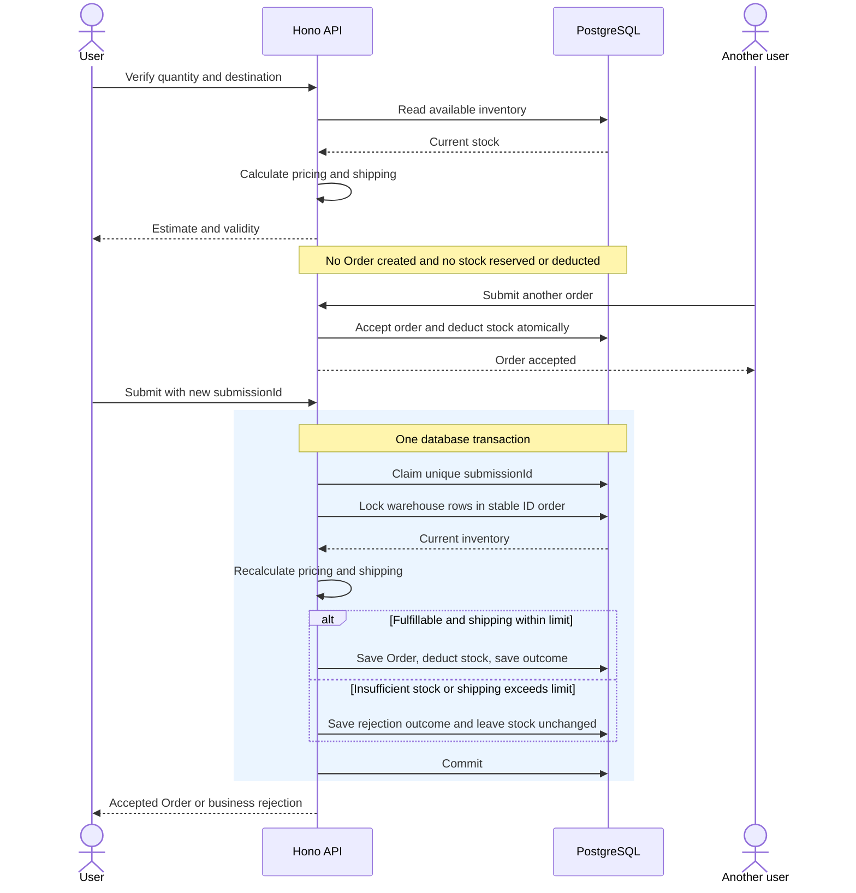

# Design interview decisions

## Agreed scope and constraints

- Produce a submission-ready design before implementation.
- The assignment is backend-only. Frontend applications, customer-facing screens, and admin dashboards are out of scope. Serving OpenAPI and interactive API documentation from the backend remains required.
- Deadline: next Monday, interpreted as September 21, 2026, Bangkok time.
- Budget: approximately four hours for core implementation, with separate review time.
- AWS deployment provisioning has a separate budget from the four-hour core implementation.
- Stack: TypeScript 7 (required), Hono, Prisma, PostgreSQL; deploy on AWS Lambda. PostgreSQL hosting and the database connection approach remain undecided.
- Use a pnpm workspace and Turborepo monorepo. Oxlint is the selected linter. Type-aware rule configuration and the formatter remain implementation choices to finalize; Oxfmt has been recommended but not explicitly selected.
- Use hexagonal architecture and domain-driven design (DDD), with one Ordering bounded context covering pricing, shipping allocation, orders, and available inventory.
- Do not use the experimental, non-standard Idempotency-Key HTTP header. Use a client-generated submissionId in the JSON request body as the idempotency key.
- Target a disposable demo deployment with documented teardown. The user has no existing AWS infrastructure or PostgreSQL database to reuse; the monthly budget is not yet specified.

## Agreed behavior

- Verification returns an advisory estimate without reserving inventory.
- Submission recalculates against current inventory. It may have a different shipping cost or become invalid after verification.
- Successful submission accepts the order and consumes its inventory atomically.
- Order total includes shipping; the shipping limit is measured against discounted merchandise only.
- Apply the highest eligible volume-discount tier to the entire order, independent of warehouse splits.
- Reject insufficient stock explicitly, without changing inventory or offering partial fulfillment.
- For insufficient stock, verification returns HTTP 200 with valid: false, reason INSUFFICIENT_STOCK, calculated merchandise and discount amounts, and null shippingCost and orderTotal. Submission returns HTTP 422 with INSUFFICIENT_STOCK and creates no order.
- Persist monetary amounts using PostgreSQL NUMERIC(12, 2): 12 total digits, including two fractional digits. Use exact monetary arithmetic in the application, preserving intermediate precision until the agreed rounding point. Round combined shipping once to two decimal places using half-up rounding, then compare that charge against 15% of the discounted merchandise total; equality passes. Persist the same monetary amounts returned to the customer.
- Calculate great-circle distances and allocate nearest warehouses first until fulfilled; use stable warehouse IDs to break equal-distance ties.
- Prevent overselling by locking all six warehouse inventory rows in stable ID order inside a database transaction before reading stock and calculating allocation. Validate the request, decrement stock, and save the order within that transaction; retry temporary transaction conflicts a bounded number of times.
- Require an idempotency key for submission. Repeating the same key and inputs returns the original order without consuming additional stock; reusing the key with different inputs returns a conflict.
- Persist successful outcomes and business rejections against their idempotency keys indefinitely for this challenge; document cleanup as future work. The same key and inputs replay the original outcome; a deliberate new submission attempt requires a new key, including after rejection. Malformed requests and transient server failures do not consume a key.
- Require positive integer quantities and finite destination coordinates within geographic bounds. Malformed inputs return HTTP 400; verification returns HTTP 200 with validity and reasons; submission returns HTTP 201 when accepted, HTTP 422 for business rejection, and HTTP 409 for conflicting idempotency-key reuse.
- Return monetary amounts as decimal strings, such as "150.00".
- Preserve each accepted order's quantity, destination, applied pricing and discount, and warehouse allocations in addition to its order number and totals.
- Provide POST /orders/verify, POST /orders (with submissionId in its JSON body), and GET /health, with OpenAPI documentation and examples. Listing, cancellation, and inventory administration are outside submission scope.

## Agreed architecture

- The Order aggregate owns accepted order details and allocations. Quantity, destination, and money are value objects; discount and shipping-plan calculations are domain functions.
- Use third normal form (3NF) as the relational database design baseline. Separate entity facts and relationships, enforce keys and foreign keys, and evaluate functional dependencies beyond the UUID primary key. Accepted order prices, discounts, shipping charges, and totals are immutable historical facts; preserve them rather than deriving them from current commercial rules. Any deliberate denormalization requires a documented reason.
- Inventory is persisted separately. The SubmitOrder application use case coordinates inventory changes and order creation atomically.
- Hono is an inbound adapter calling VerifyOrder and SubmitOrder application use cases. Lambda starts the application.
- Application use cases depend on the domain model and application-owned persistence interfaces. The Prisma outbound adapter implements persistence and transaction locking.
- Prisma types and HTTP objects stay outside the domain and application use cases.
- A transaction interface encompasses stock reads, order and allocation persistence, inventory updates, and idempotency outcomes together.
- Persist application outcomes and result snapshots, not HTTP status codes or HTTP response envelopes. The Hono adapter maps accepted/rejected/conflicting outcomes to HTTP responses, including on replay.
- Use UUIDv7 for generated database entity IDs, stored in PostgreSQL UUID columns; referencing foreign keys use the same type. This includes warehouse and order IDs and any separate allocation or submission-record IDs. Keep seeded warehouse UUIDv7 values stable across seed runs so lock ordering and equal-distance allocation remain deterministic.
- UUIDv7 supports time-oriented ID sorting, not a guarantee of transaction commit order or strict chronology across concurrent generators. Use explicit ORDER BY for ordered results. See [RFC 9562, section 5.7](https://www.rfc-editor.org/rfc/rfc9562.html#name-uuid-version-7). The generation mechanism remains an implementation choice.
- Hasura-style enum lookup tables retain their agreed text primary keys. The client-generated submissionId remains a separate retry key; this database ID decision does not change its API contract or the order-number format.
- Use Hasura-style enum lookup tables with text primary keys and foreign keys for persisted categorical values; do not use PostgreSQL native enums or Prisma enum declarations that create them. Apply this to submission outcomes and rejection codes. This adopts the database pattern without adding Hasura to the stack.
- Maintain lookup values through versioned migrations. Prisma represents these as String fields and relations; domain types remain string literal unions with validation at the adapter seam. Referenced values cannot be removed until references are migrated; avoid cascading deletion of historical records.
- Enum-table reference: https://hasura.io/docs/2.0/schema/postgres/enums/ . Follow its compatible table shape: one text primary-key column, optionally one text description column, no other columns, at least one value, and GraphQL-compatible value names. Insert initial values in migrations rather than relying on development seeds. Hasura metadata configuration is not needed in our Hono/Prisma stack.

## Agreed validation strategy

- Unit tests cover discount boundaries, allocation, rounding, and the shipping limit.
- Real PostgreSQL integration tests cover rollback, simultaneous submissions, and idempotency.
- Provide easy local start/test commands and documented API examples.

## OpenAPI deliverable

- Deliver a machine-readable OpenAPI specification for POST /orders/verify, POST /orders, and GET /health, generated from the API adapter's route and validation schemas.
- Serve the specification at GET /openapi.json and interactive API documentation at GET /docs. Provide a deterministic export command producing docs/openapi.json for review without starting the application or connecting to PostgreSQL.
- Document request and response schemas, quantity and coordinate constraints, submissionId, decimal-string monetary amounts, nullable totals for insufficient stock, and business rejection codes.
- Include examples of valid verification, insufficient stock, excessive shipping, accepted submission, replay, and conflicting submissionId reuse. Describe outcome retention and the requirement for a new ID for a new attempt.
- Document success responses and malformed-input, business-rejection, conflicting-ID, and transient-failure responses. HTTP status mapping belongs to the API adapter and specification, never persisted submission records.
- Validate the generated specification and check representative HTTP responses against its schemas. Check that the committed export matches regenerated output.

## Verification and submission sequence

Verification is advisory: another order can consume inventory before submission. The following flow shows a new submission attempt. A retry of a completed attempt returns its saved outcome without recalculating or deducting stock again; reuse with different inputs returns a conflict.

## Unresolved

- Monthly demo budget, PostgreSQL hosting, and database connection approach; deployment starts from scratch.
- Deployment exposure and packaging, subject to Q26 infrastructure and budget constraints.
